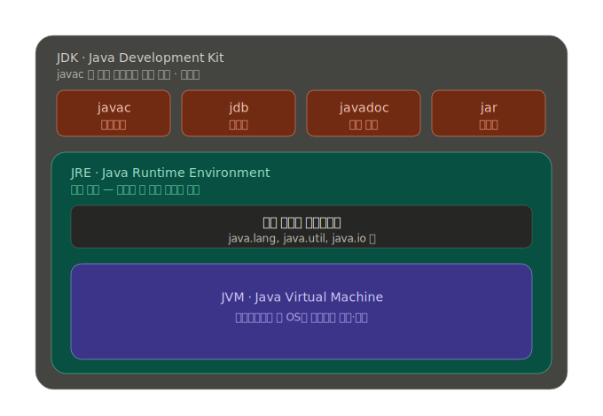

# Java "한 번 작성하면 어디서든 실행"
- Java 코드는 바로 컴퓨터가 이해하는 기계어로 변환되지 않는다. 
- 중간 단계인 **바이트코드(.class)** 로 먼저 변환된다. 
- 이 바이트코드는 운영체제(윈도우/맥/리눅스)에 상관없이 똑같다. 
- 그래서 Java가 "운영체제를 가리지 않는다"는 특징을 갖게 되는데, 이걸 가능하게 해주는 주인공이 바로 JVM입니다.

# JVM (Java Virtual Machine)
- 운영체제마다 다르게 설치되는 일종의 "가상 컴퓨터"이다. 
- 어떤 OS든 똑같은 바이트코드를 받아서, **그 OS에 맞는 기계어로 실시간 번역해서 실행**해 준다. 
- 즉 바이트코드는 하나지만 JVM은 OS마다 따로 있어서, 윈도우용 JVM·맥용 JVM이 각자 자기 컴퓨터 언어로 바꿔준다. Java 코드를 실제로 "돌아가게" 하는 엔진이다.

# JRE (Java Runtime Environment)
- JVM 하나만으로는 프로그램이 못 돈다. 
- System.out.println 같은 기본 기능들(표준 라이브러리)이 함께 있어야 한다. 
- JRE = JVM + 표준 라이브러리 + 실행에 필요한 파일들이다. 
- 즉 "Java 프로그램을 실행만 하는 데 필요한 한 세트"이다. 남이 만든 Java 프로그램을 그냥 쓰기만 하는 사람에게는 JRE면 충분하다.

# JDK (Java Development Kit)
- 우리가 직접 작성한 .java 파일을 바이트코드(.class)로 바꾸는 컴파일 과정이 필요한데, 이때 쓰는 컴파일러 javac가 JRE에는 없다.
- **JDK = JRE + 개발 도구(javac 컴파일러, 디버거 jdb, javadoc, jar 등)** 이다. 개발 도구가 전부 들어 있는 가장 큰 묶음이다.

-> 이 세 가지는 따로 떨어진 게 아니라 JDK가 JRE를 품고, JRE가 JVM을 품는 포함 관계이다!
# 그래서 "왜 JDK를 써야 하나?"
`Hello.java` (사람이 쓴 코드) → **`javac`로 컴파일** → `Hello.class` (바이트코드) → **`java`로 JVM 실행** → 화면 출력

여기서 `.java`를 `.class`로 바꾸는 컴파일러 `javac`는 **JRE에는 없고 JDK에만** 있다.