# AWS 학습 가이드 — MSA 프로젝트를 AWS에 올리기

> **기준 자료**: `docker/aws-배포-가이드.md` (09.28~09.29 수업), `msa/aws-architecture.html` (아키텍처 다이어그램)
> **현재 진행상황 (2026.09.29 기준)**
> - ✅ 09.28: AWS 인프라 구축(VPC ~ EC2) + DB 서버(MySQL) 셋팅 → 5~7장
> - ✅ 09.29: app 서버에 Docker·Git 설치 → GitHub Deploy Key → `docker-compose.aws.yml` + `.env` + `deploy.sh` 로 서비스 구동 → 8장
> - ✅ 09.29 (오후): Nginx 설치 · 설정 → 카카오 Redirect URI 등록 → 브라우저로 `http://<EIP>` 접속 → 9장 (README 09.29 "aws 인프라 구축 및 서비스 구동")
> - ✅ 09.30: CI/CD — GitHub Actions(`appleboy/ssh-action`) + Secrets로 `deploy-test` 브랜치 push 시 자동 배포, SSH 22번 `0.0.0.0/0` 허용 → 10장
> - ⏭️ 다음: 수업 진행에 따라 추가
>
> 📌 문서에서 **[강의]** 표시는 수업 자료에 있는 내용, **[보충]** 표시는 이해를 돕기 위해 덧붙인 내용입니다.
> 🖼️ 그림은 `msa/images/aws/` 폴더에 있습니다. (VS Code: `Cmd+Shift+V` 로 마크다운 미리보기)

---

## 목차
0. [한 장 요약](#0-한-장-요약)
1. [AWS 계정 생성 후 처음 할 일](#1-aws-계정-생성-후-처음-할-일)
2. [EC2 쉽게 이해하기](#2-ec2-쉽게-이해하기)
3. [큰 그림: 로컬 Docker → AWS로 무엇이 바뀌나](#3-큰-그림-로컬-docker--aws로-무엇이-바뀌나)
4. [AWS 핵심 개념 (이것만 알면 된다)](#4-aws-핵심-개념-이것만-알면-된다)
5. [실습: 인프라 구축 단계별 따라하기](#5-실습-인프라-구축-단계별-따라하기)
6. [서버 접속하기 (SSH / SCP / Bastion)](#6-서버-접속하기-ssh--scp--bastion)
7. [DB 서버 셋팅 (MySQL)](#7-db-서버-셋팅-mysql)
8. [app 서버 셋팅: Docker·Git 설치와 서비스 배포](#8-app-서버-셋팅-dockergit-설치와-서비스-배포) 🆕 09.29
9. [Nginx 도입: 브라우저로 접속하기](#9-nginx-도입-브라우저로-접속하기) 🆕 09.29
10. [CI/CD: GitHub Actions로 자동 배포](#10-cicd-github-actions로-자동-배포) 🆕 09.30
11. [비용과 자원 삭제](#11-비용과-자원-삭제)
12. [자주 막히는 곳 (트러블슈팅)](#12-자주-막히는-곳-트러블슈팅)
13. [최종 체크리스트](#13-최종-체크리스트)

> **추천 학습 순서**: 0장(그림으로 전체 보기) → 1장(계정 셋팅) → 2장·4장(개념) → 5~10장(실습) → 12장(막히면)

---

## 0. 한 장 요약

### 😮‍💨 너무 어렵게 느껴진다면: 이것만 기억하기
처음 보는 단어가 한꺼번에 쏟아져서 어려운 거지, **하는 일 자체는 4단계**입니다. 지금 내가 몇 번 단계인지, 그 단계의 **"확인"** 이 되는지만 보면 돼요.

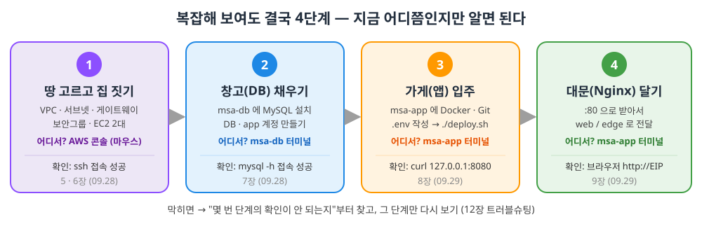

| 단계 | 한 줄 요약 | 성공 확인 (이게 되면 다음으로) |
|---|---|---|
| 1. 집 짓기 | AWS 콘솔에서 네트워크 + 컴퓨터 2대 만들기 | 내 PC → `ssh ubuntu@<EIP>` 접속 |
| 2. 창고 채우기 | msa-db에 MySQL 설치, 계정 만들기 | msa-app에서 `mysql -h <db IP> -u app -p` 접속 |
| 3. 가게 입주 | msa-app에 Docker 설치, `.env` 쓰고 `./deploy.sh` | msa-app에서 `curl -I http://127.0.0.1:8080` → 200 |
| 4. 대문 달기 | Nginx가 :80으로 받아 web/edge로 전달 | 내 PC 브라우저에서 `http://<EIP>` 화면 |
| ➕ 5. 자동화 (09.30) | 1~4는 그대로 두고, **3번의 `./deploy.sh`를 사람 대신 GitHub가 실행** | `git push` 후 GitHub **Actions** 탭 ✅ (10장) |

> 💡 **전부 이해하고 넘어가지 않아도 됩니다.** 처음엔 "따라 쳐서 확인이 되는 것"이 목표이고, 개념(2·4장)은 한 번 성공한 뒤에 다시 읽으면 훨씬 잘 들어와요.

### 최종 모습

우리가 최종적으로 만들 모습입니다. 처음엔 낯설어도, 문서를 다 보고 다시 이 그림을 보면 전부 읽힙니다.

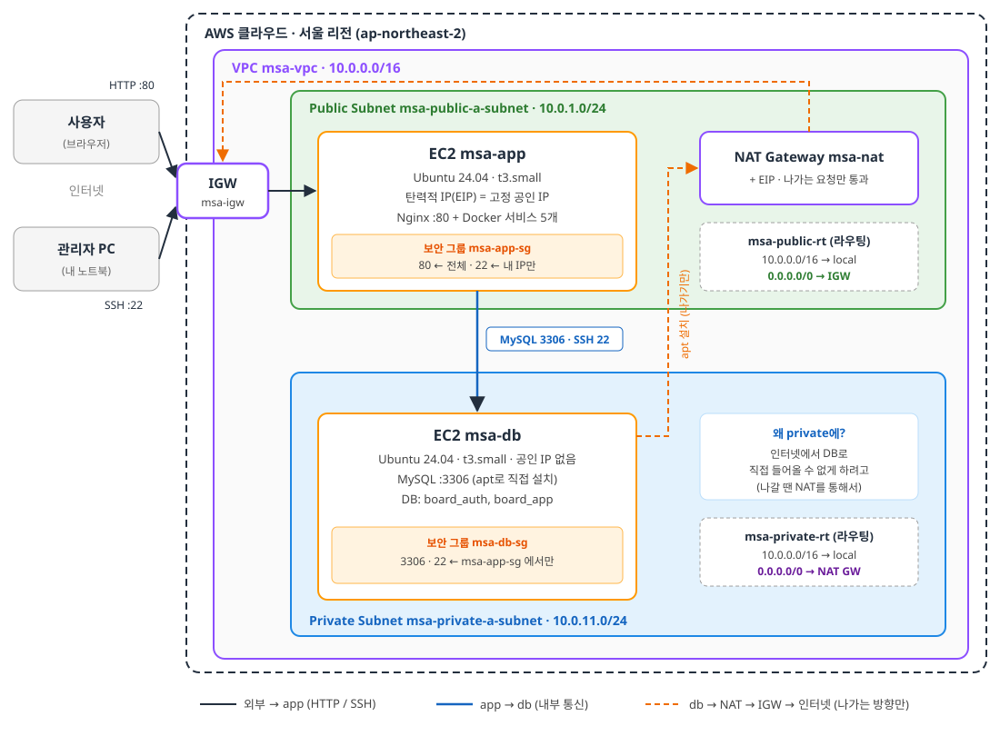

| 흐름 | 경로 |
|---|---|
| 서비스 요청 | 사용자 → IGW → msa-app(Nginx :80) → web → edge → auth/board → msa-db(MySQL :3306) |
| 관리(SSH) | 관리자 PC → msa-app :22 (**Bastion**) → msa-db :22 |
| DB 서버 인터넷 사용 | msa-db → NAT GW → IGW → 인터넷 (apt 설치 등, **나가는 방향만**) |

> ⚠️ **[보충] CIDR 표기 차이**: 강의 가이드(md)는 private 서브넷을 `10.0.11.0/24`, 다이어그램(html)은 `10.0.2.0/24`로 적고 있습니다. 둘 다 동작하니 **하나로 정해서 끝까지 일관되게** 쓰면 됩니다. 이 문서는 강의 가이드(`10.0.11.0/24`)를 따릅니다.

---

## 1. AWS 계정 생성 후 처음 할 일

> [보충] 강의는 VPC 만들기부터 시작하지만, **가입 직후 이 5단계를 먼저 해두면** 해킹과 요금 폭탄을 막을 수 있습니다. 15~20분이면 끝나요.

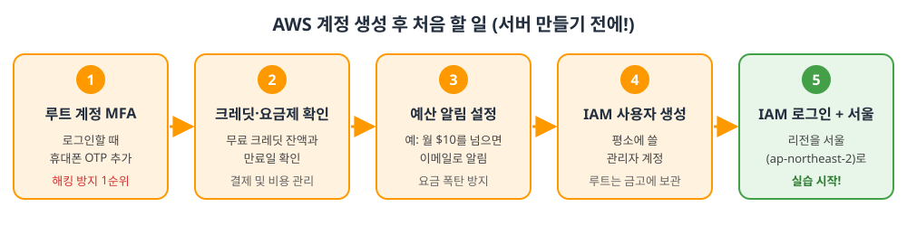

### 1-0. 먼저 알아둘 용어: 루트 사용자 vs IAM 사용자
| | 루트 사용자 (Root) | IAM 사용자 |
|---|---|---|
| 정체 | **가입할 때 쓴 이메일** 계정 | 루트가 만들어주는 **하위 계정** |
| 권한 | 모든 것 (계정 해지, 결제 수단 변경까지) | 준 권한만큼만 |
| 비유 | 건물주 마스터키 | 직원 출입증 |
| 사용 | 처음 설정할 때만, 평소엔 금고에 | **평소 실습은 이걸로** |

→ 마스터키를 들고 다니다 잃어버리면 끝이니까, 평소엔 출입증(IAM)을 씁니다.

### 1-1. 콘솔 로그인 + 한국어 설정
1. https://console.aws.amazon.com 접속 → **루트 사용자** 선택 → 가입 이메일 / 비밀번호로 로그인
2. 화면이 영어라면: 오른쪽 위 **톱니바퀴(설정)** → Language → **한국어**
3. 위쪽 **검색창**에 서비스 이름(EC2, VPC, IAM, Billing...)을 치면 바로 이동합니다. 앞으로 계속 이 검색창을 씁니다.

### 1-2. 루트 계정에 MFA 걸기 (가장 중요!)
**MFA(다중 인증)** = 비밀번호 + 휴대폰 OTP 6자리. 비밀번호가 털려도 휴대폰이 없으면 로그인 불가.

1. 휴대폰에 **Google Authenticator** 또는 **Microsoft Authenticator** 앱 설치
2. 콘솔 오른쪽 위 **계정 이름 클릭 → 보안 자격 증명**
3. **멀티 팩터 인증(MFA) → MFA 디바이스 할당**
4. 디바이스 이름 입력(예: `my-phone`) → **인증 관리자 앱** 선택 → 다음
5. 화면의 **QR 코드를 앱으로 스캔** → 앱에 뜨는 **연속된 6자리 코드 2개**를 차례로 입력 → 완료

> ⚠️ 루트 계정의 **액세스 키(Access Key)는 절대 만들지 마세요.** 코드/깃허브에 유출되면 채굴 서버가 돌아가 수백만 원이 청구되는 사고가 실제로 자주 납니다.

### 1-3. 무료 크레딧 / 요금제 확인
- 검색창 → **결제 및 비용 관리 (Billing and Cost Management)** → 왼쪽 메뉴 **크레딧**
- 2025년 7월 이후 가입한 계정은 **무료 크레딧(가입 시 $100 + 튜토리얼 활동으로 추가 획득)** 방식입니다. 크레딧 **잔액과 만료일**을 꼭 확인하세요.
- 그 전에 가입한 계정은 "12개월 프리 티어"(t2.micro / t3.micro 월 750시간 무료 등) 방식입니다.
- 💡 우리 실습의 **t3.small, NAT Gateway, 탄력적 IP는 "항상 무료" 대상이 아닙니다.** 크레딧이 있으면 크레딧에서 차감되고, 없으면 카드로 청구됩니다. → 그래서 다음 단계(예산 알림)가 중요합니다.

> 가입 시점마다 조건이 조금씩 다르므로, **정확한 내용은 콘솔의 크레딧 / 프리 티어 화면에서 직접 확인**하세요.

### 1-4. 예산 알림 설정 (요금 폭탄 방지)
1. 결제 및 비용 관리 → 왼쪽 **예산(Budgets)** → **예산 생성**
2. **템플릿 사용(간소화)** → **월별 비용 예산** 선택
3. 예산 이름: `monthly-10usd`, 금액: `10` (USD), 이메일: 내 메일 → **예산 생성**
4. 이제 실제 비용이 예산의 85%, 100%에 도달하거나 100%를 넘을 것으로 예측되면 **메일이 옵니다.**

> 알림은 "알려주기만" 합니다. 자동으로 서버를 꺼주지는 않으니, 메일을 받으면 바로 11장(자원 삭제)을 확인하세요.

### 1-5. 평소에 쓸 IAM 사용자 만들기
1. 검색창 → **IAM** → 왼쪽 **사용자** → **사용자 생성**
2. 사용자 이름: 예) `admin`
3. ☑ **AWS Management Console에 대한 사용자 액세스 권한 제공** 체크
   - "IAM Identity Center 사용 권장" 안내가 나오면 → **IAM 사용자를 생성하고 싶음** 선택 (개인 실습은 이걸로 충분)
   - 콘솔 암호: **사용자 지정 암호** 입력, "다음 로그인 시 새 암호 생성" 은 체크 해제해도 됨
4. 권한 설정 → **직접 정책 연결** → 검색 `AdministratorAccess` 체크 → 다음 → **사용자 생성**
5. 완료 화면의 **콘솔 로그인 URL**(`https://<12자리 계정ID>.signin.aws.amazon.com/console`)을 **즐겨찾기 / 메모**
6. (권장) 방금 만든 IAM 사용자에도 1-2와 같은 방법으로 MFA 설정

**IAM 사용자로 요금 화면을 보려면** (루트로 한 번만):
오른쪽 위 계정 이름 → **계정** → 아래쪽 **"IAM 사용자 및 역할의 결제 정보 액세스"** → 편집 → **활성화**
(안 하면 IAM 사용자로 결제 화면에 들어갈 때 "액세스 거부"가 뜹니다.)

### 1-6. IAM 사용자로 다시 로그인 + 서울 리전 선택
1. 루트 로그아웃 → 1-5의 **로그인 URL**로 접속 → IAM 사용자 이름/암호로 로그인
2. 오른쪽 위 리전 메뉴 → **아시아 태평양(서울) ap-northeast-2** 선택
3. ✅ 이제 5장 실습을 시작하면 됩니다.

> 💡 **리전이란?** AWS 데이터센터가 있는 도시입니다. 리전마다 자원이 따로 관리되기 때문에 **도쿄 리전에서 만든 서버는 서울 리전 화면에 안 보입니다.** "어? 내가 만든 게 없어졌다!" 의 90%는 리전이 바뀐 경우입니다.

---

## 2. EC2 쉽게 이해하기

### 2-1. 한 줄 정의
> **EC2 (Elastic Compute Cloud) = AWS 데이터센터에 있는 컴퓨터를 시간 단위로 빌려 쓰는 서비스**

- 내 노트북에서 `./start.sh` 로 서비스를 띄우면 → 노트북을 끄는 순간 서비스도 꺼지고, 다른 사람은 접속할 주소도 없습니다.
- EC2는 **24시간 켜져 있고, 공인 IP가 있는 컴퓨터**를 빌려줍니다. 필요 없으면 반납(종료)하면 됩니다.
- 모니터·키보드는 없습니다. 대신 **내 터미널에서 SSH로 원격 접속**해서 리눅스 명령어로 조작합니다. (그래서 리눅스 명령어를 배운 것!)
- EC2로 빌린 컴퓨터 한 대를 **인스턴스(Instance)** 라고 부릅니다. 우리는 2대(`msa-app`, `msa-db`)를 빌립니다.

### 2-2. EC2를 만들 때 고르는 6가지

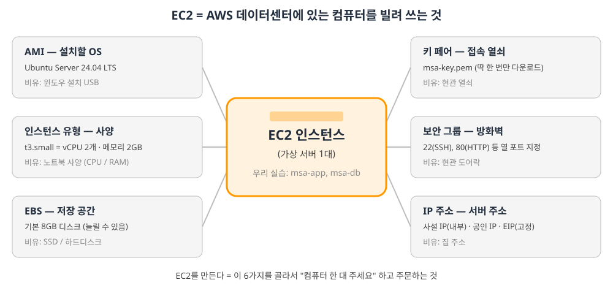

| 구성 요소 | 뜻 | 우리 실습 값 | 비유 |
|---|---|---|---|
| **AMI** | 설치할 OS 이미지 | Ubuntu Server 24.04 LTS | 윈도우 설치 USB |
| **인스턴스 유형** | CPU / 메모리 사양 | t3.small (vCPU 2, 메모리 2GB) | 노트북 사양 |
| **EBS** | 저장 공간(디스크) | 기본 8GB | SSD |
| **키 페어** | SSH 접속 열쇠 | msa-key.pem | 현관 열쇠 |
| **보안 그룹** | 방화벽 (열 포트) | msa-app-sg / msa-db-sg | 도어락 |
| **네트워크 (VPC·서브넷·IP)** | 어디에 놓을지, 주소 | public / private 서브넷 | 집 위치·주소 |

> 💡 도커와 비교하면: **AMI ≈ 도커 이미지**, **인스턴스 ≈ 컨테이너**. 이미지(AMI)로 실제 실행되는 것(인스턴스)을 만든다는 구조가 같습니다. 다만 EC2는 "컴퓨터 통째로" 입니다.

### 2-3. 인스턴스 유형 읽는 법: `t3.small`
```
 t      3      .small
 │      │        └─ 크기: nano < micro < small < medium < large < xlarge ...
 │      └────────── 세대: 숫자가 클수록 최신
 └───────────────── 패밀리: t = 범용·버스트형 (평소엔 조금, 필요할 때 순간적으로 CPU를 더 씀)
```
| 유형 | vCPU | 메모리 | 메모 |
|---|---|---|---|
| t3.micro | 2 | 1GB | 프리 티어 대상인 경우가 많음, Spring 여러 개는 부족 |
| **t3.small** | **2** | **2GB** | **수업에서 사용** |
| t3.medium | 2 | 4GB | 여유 있음, 비용 2배 |

→ 사양이 올라갈수록 **시간당 요금도 올라갑니다.**

### 2-4. EC2의 상태와 요금

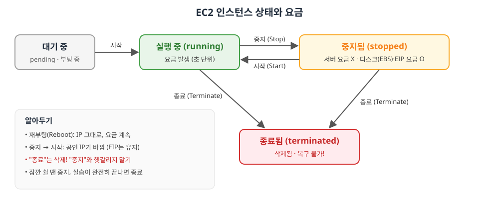

| 버튼 | 결과 | 요금 | 되돌리기 |
|---|---|---|---|
| **중지 (Stop)** | 컴퓨터 전원 끄기 | 서버 요금 멈춤 (디스크·EIP는 계속) | 다시 **시작** 가능 |
| **재부팅 (Reboot)** | 껐다 켜기 | 계속 | - |
| **종료 (Terminate)** | **컴퓨터 반납 = 삭제** | 멈춤 | ❌ **불가능** (안의 데이터 전부 사라짐) |

> ⚠️ 한국어 콘솔에서 "**인스턴스 종료**"는 끄는 게 아니라 **삭제**입니다! 잠깐 쉬려면 "**인스턴스 중지**"를 누르세요.

### 2-5. 콘솔의 "인스턴스 시작" 화면 한눈에 보기
EC2 → **인스턴스 시작** 을 누르면 위에서 아래로 이런 칸들이 나옵니다. (msa-app 기준)

| 화면의 칸 | 무엇을 하나 | msa-app 에 넣을 값 |
|---|---|---|
| **이름 및 태그** | 서버 이름 | `msa-app` |
| **애플리케이션 및 OS 이미지 (AMI)** | OS 선택 | Ubuntu → **Ubuntu Server 24.04 LTS** |
| **인스턴스 유형** | 사양 | `t3.small` |
| **키 페어(로그인)** | 접속 열쇠 | **새 키 페어 생성** → 이름 `msa-key`, RSA, **.pem** → 자동 다운로드 |
| **네트워크 설정** → **편집** 버튼 | 위치·방화벽 | VPC `msa-vpc` / 서브넷 `msa-public-a-subnet` / 퍼블릭 IP 자동 할당 **활성화** / **기존 보안 그룹 선택** → `msa-app-sg` |
| **스토리지 구성** | 디스크 크기 | 기본 8GiB (강의 기본값) · [보충] app 서버에서 도커 이미지를 여러 개 빌드하면 부족할 수 있어 16~20GiB로 늘려도 됨 |
| **고급 세부 정보** | 추가 옵션 | 건드리지 않음 |
| 오른쪽 **요약** → **인스턴스 시작** | 생성! | 1~2분 뒤 "실행 중" |

> ⚠️ **네트워크 설정은 반드시 "편집"** 을 눌러야 VPC/서브넷을 고를 수 있습니다. 안 누르면 AWS가 기본으로 만들어 둔 **기본 VPC(default VPC)** 에 생성돼서, 우리가 만든 네트워크와 따로 놀게 됩니다.

### 2-6. 만든 뒤에 확인할 곳
EC2 → 인스턴스 → 서버 체크 → 아래 **세부 정보** 탭

| 항목 | 의미 | 언제 쓰나 |
|---|---|---|
| 인스턴스 상태 | 실행 중 / 중지됨 ... | 서버가 켜져 있는지 |
| **퍼블릭 IPv4 주소** | 인터넷에서 접속하는 주소 | `ssh ubuntu@<이 주소>` (EIP 연결 후엔 EIP) |
| **프라이빗 IPv4 주소** | VPC 내부 주소 (10.0.x.x) | app → db 접속, DB_URL |
| **보안** 탭 | 붙어있는 보안 그룹과 규칙 | 접속이 안 될 때 확인 |
| **네트워킹** 탭 | VPC, 서브넷 | 제대로 된 곳에 만들었는지 |

### 2-7. 접속하는 두 가지 방법
| 방법 | 어떻게 | 비고 |
|---|---|---|
| **SSH (수업 방식)** | 내 터미널에서 `ssh -i msa-key.pem ubuntu@<IP>` | 6장에서 자세히 |
| EC2 Instance Connect | 콘솔에서 인스턴스 선택 → **연결** 버튼 → 브라우저에 터미널 | [보충] 공인 IP가 있는 서버만 가능. 보안그룹 22번을 "내 IP"로만 열었다면 브라우저 접속은 막힐 수 있음 |

---

## 3. 큰 그림: 로컬 Docker → AWS로 무엇이 바뀌나

지금까지(09.22~09.23) 내 PC에서 한 것:

```
내 PC (Docker Desktop)
 └─ msa-network
     ├─ mysql (컨테이너, 3307:3306)
     ├─ config / auth / board / edge (컨테이너)
     └─ web (컨테이너)
```

AWS에서는 **"내 PC" 역할을 EC2(클라우드의 가상 컴퓨터)가 대신**합니다. 차이는:

| 항목 | 로컬 | AWS |
|---|---|---|
| 컴퓨터 | 내 노트북 | EC2 2대 (`msa-app`, `msa-db`) |
| MySQL | Docker 컨테이너 | **msa-db EC2에 apt로 직접 설치** |
| 서비스 5개 | Docker 컨테이너 | msa-app EC2 위의 Docker 컨테이너 (8장) |
| 네트워크 | Docker 네트워크 `msa-network` | **VPC / 서브넷 / 라우팅 / 보안그룹** + Docker 네트워크 |
| 외부 공개 | localhost | 고정 공인 IP(EIP) + Nginx :80 |
| DB 접속 주소 | `mysql:3306` (컨테이너 이름) | `10.0.11.x:3306` (msa-db의 사설 IP) |

**핵심:** Docker는 이미 알고 있으니, 새로 배우는 건 **"AWS 안에 네트워크(집터)를 만들고, 그 위에 컴퓨터를 놓고, 누가 어디로 드나들 수 있는지 정하는 것"** 입니다.

---

## 4. AWS 핵심 개념 (이것만 알면 된다)

### 🏢 비유로 먼저 이해하기: "아파트 단지"

| AWS | 아파트 비유 | 한 줄 설명 |
|---|---|---|
| **리전 (Region)** | 도시 (서울) | AWS 데이터센터가 모여있는 지역. 우리는 `ap-northeast-2`(서울) |
| **가용 영역 (AZ)** | 도시 안의 동네 | 리전 안의 독립된 데이터센터. `ap-northeast-2a` 등 |
| **VPC** | 아파트 단지 전체 (울타리) | 나만의 격리된 사설 네트워크 |
| **서브넷 (Subnet)** | 단지 안의 동(棟) | VPC를 쪼갠 구역. public / private |
| **IGW (인터넷 게이트웨이)** | 단지 정문 | VPC ↔ 인터넷을 연결하는 문 (양방향) |
| **NAT Gateway** | 택배 발송 전용 창구 | private 서버가 **밖으로 나가는 것만** 허용 (들어오는 건 차단) |
| **라우팅 테이블** | 단지 안 도로 표지판 | "이 목적지로 가려면 어느 문으로 가라" |
| **보안그룹 (SG)** | 각 집 현관 도어락 | 서버(EC2) 단위 방화벽. 어떤 포트를 누구에게 열지 |
| **EC2** | 집 (컴퓨터) | 클라우드 가상 서버 |
| **키 페어 (.pem)** | 현관 열쇠 | SSH 접속용 비밀 키 파일 |
| **탄력적 IP (EIP)** | 고정 주소(도로명 주소) | 재부팅해도 안 바뀌는 고정 공인 IP |
| **Bastion** | 경비실 | 외부에서 내부 서버로 가려면 반드시 거치는 중간 서버 |

### 4-1. VPC와 CIDR

- **VPC** = AWS 안의 "내 전용 네트워크". 다른 사람의 서버와 완전히 분리됩니다.
- **CIDR** = IP 범위를 표기하는 방법. `/` 뒤 숫자가 **고정되는 앞자리 비트 수**입니다.

| CIDR | 의미 | IP 개수 |
|---|---|---|
| `10.0.0.0/16` | `10.0.x.x` 전부 (앞 16비트 고정) | 65,536개 |
| `10.0.1.0/24` | `10.0.1.x` 전부 (앞 24비트 고정) | 256개 (AWS가 5개 예약 → 251개 사용) |

```
msa-vpc            10.0.0.0/16   → 10.0.0.0 ~ 10.0.255.255
 ├ public-a        10.0.1.0/24   → 10.0.1.0 ~ 10.0.1.255
 └ private-a       10.0.11.0/24  → 10.0.11.0 ~ 10.0.11.255
```
> 서브넷은 반드시 VPC 범위 **안에** 있어야 하고, 서로 **겹치면 안 됩니다.**

### 4-2. Public vs Private 서브넷 — 차이는 "라우팅 테이블" 하나

서브넷 자체에는 public/private 스위치가 없습니다. **어느 라우팅 테이블을 붙이느냐**로 결정됩니다.

| | public 서브넷 | private 서브넷 |
|---|---|---|
| 라우팅 `0.0.0.0/0` →| **IGW** | **NAT GW** |
| 인터넷에서 들어오기 | ✅ (공인 IP 있으면) | ❌ 불가 |
| 인터넷으로 나가기 | ✅ | ✅ (NAT 통해서만) |
| 우리 배치 | msa-app, NAT GW | msa-db |

- `0.0.0.0/0` = "그 외 모든 목적지" (기본 경로)
- `10.0.0.0/16 → local` = VPC 내부끼리는 자동으로 통신 (라우팅 테이블에 기본 포함)

**왜 DB를 private에 두나?** DB는 인터넷에서 직접 접근할 이유가 없고, 노출되면 공격 대상이 됩니다. app 서버만 DB에 접근하면 됩니다.

**그럼 NAT는 왜 필요?** private의 msa-db도 `apt install mysql-server` 처럼 **인터넷에서 뭔가 받아와야** 합니다. NAT는 "나가는 요청 + 그 응답"만 통과시키고, 밖에서 먼저 들어오는 연결은 막습니다.

### 4-3. 보안그룹 (Security Group)

- EC2에 붙는 **방화벽**. 기본적으로 **인바운드(들어오는 것)는 전부 차단**, 아웃바운드(나가는 것)는 전부 허용.
- 인바운드 규칙 = "**어떤 포트**를 **누구(소스)** 에게 열까"

| 보안그룹 | 포트 | 소스 | 이유 |
|---|---|---|---|
| **msa-app-sg** | 22 (SSH) | 내 IP | 나만 서버 접속 |
| | 80 (HTTP) | 0.0.0.0/0 (전체) | 누구나 웹사이트 접속 |
| **msa-db-sg** | 22 (SSH) | **msa-app-sg** | app 서버를 거쳐서만 접속 |
| | 3306 (MySQL/Aurora) | **msa-app-sg** | app 서버의 서비스만 DB 접속 |

> 💡 **소스에 IP 대신 "보안그룹"을 넣는다** = "msa-app-sg가 붙은 서버에서 오는 요청만 허용". app 서버 IP가 바뀌어도 규칙을 고칠 필요가 없습니다. 이것이 강의에서 말한 **"사용자 지정 - msa-app-sg"** 입니다.

### 4-4. EC2 / 키 페어 / 탄력적 IP
> EC2 자체에 대한 쉬운 설명은 [2장](#2-ec2-쉽게-이해하기)에 따로 정리했습니다.


- **EC2**: 우분투(Ubuntu 24.04)가 깔린 가상 컴퓨터. `t3.small` = vCPU 2개, 메모리 2GB 사양.
- **키 페어(.pem)**: 비밀번호 대신 쓰는 열쇠 파일. **생성 시 딱 한 번만 다운로드됩니다.** 잃어버리면 그 서버에 접속 불가 → 절대 Git에 올리지 말 것.
- **공인 IP vs 탄력적 IP**: EC2 공인 IP는 **중지 → 시작하면 바뀝니다.** EIP를 붙이면 고정됩니다. (카카오 OAuth redirect URI를 `http://<EIP>/login/oauth2/code/kakao`로 등록해야 하므로 고정 IP가 필요)

---

## 5. 실습: 인프라 구축 단계별 따라하기

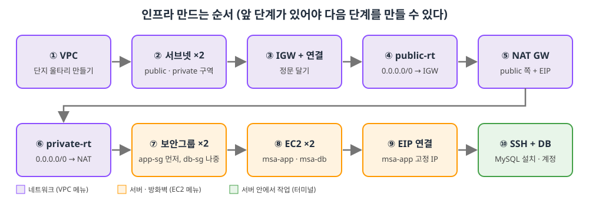

> **[보충] 시작 전**: AWS 콘솔 오른쪽 위 리전이 **아시아 태평양(서울) ap-northeast-2** 인지 먼저 확인! 리전이 다르면 만든 자원이 안 보입니다.
>
> **[보충] 만드는 순서가 중요한 이유**: "문(IGW)을 달기 전에는 도로 표지판(라우팅)에 문을 적을 수 없고, 정문이 없으면 택배 창구(NAT)도 못 만든다." 아래 순서대로 하면 막히지 않습니다.

### STEP 1) VPC 생성 — `msa-vpc` [강의]
- 콘솔 검색창 → **VPC** → VPC 생성
- **"VPC만"** 선택 (VPC 등 = 자동 생성 옵션은 쓰지 않음 → 하나하나 직접 만들며 배우기 위해)
- 이름: `msa-vpc`
- IPv4 CIDR: `10.0.0.0/16`

### STEP 2) 서브넷 생성 [강의]
- VPC → 서브넷 → 서브넷 생성 → VPC: `msa-vpc`

| 이름 | 가용 영역 [보충] | IPv4 CIDR |
|---|---|---|
| `msa-public-a-subnet` | ap-northeast-2a | `10.0.1.0/24` |
| `msa-private-a-subnet` | ap-northeast-2a | `10.0.11.0/24` |

> 이름의 `-a`는 가용 영역 `2a`를 뜻합니다. 두 서브넷을 같은 AZ에 두세요.

### STEP 3) 인터넷 게이트웨이 — `msa-igw` [강의]
- VPC → 인터넷 게이트웨이 → 생성 (이름 `msa-igw`)
- 생성 후 **작업 → VPC에 연결 → `msa-vpc`**
- ⚠️ 연결(Attach)을 안 하면 라우팅 테이블에서 IGW가 목록에 안 뜹니다.

### STEP 4) public 라우팅 테이블 — `msa-public-rt` [강의]
- VPC → 라우팅 테이블 → 생성: 이름 `msa-public-rt`, VPC `msa-vpc`
- **라우팅 편집** → 라우팅 추가: 대상 `0.0.0.0/0` → 타겟 **인터넷 게이트웨이 `msa-igw`**
- **서브넷 연결 편집** → `msa-public-a-subnet` 체크

> 이 순간 `msa-public-a-subnet`이 **진짜 public 서브넷**이 됩니다.

### STEP 5) NAT 게이트웨이 — `msa-nat` [강의]
- VPC → NAT 게이트웨이 → 생성
- 이름 `msa-nat`, VPC: `msa-vpc` (강의 기준)
- 연결 유형: **퍼블릭**, **탄력적 IP 할당** 버튼 클릭 (NAT도 인터넷에 나가려면 공인 IP가 필요)
- ⚠️ 강의 포인트: **IGW 연결 + public 라우팅까지 끝나야** NAT 생성 화면에서 msa-vpc를 고를 수 있습니다.
- [보충] 콘솔 화면에서 VPC 대신 **서브넷**을 고르라고 나오면 반드시 **`msa-public-a-subnet`** 을 선택하세요. NAT는 인터넷에 닿아야 하므로 public 쪽에 있어야 합니다. (private에 두면 동작하지 않음)
- 상태가 **Available**이 될 때까지 1~2분 대기

### STEP 6) private 라우팅 테이블 — `msa-private-rt` [강의]
- 라우팅 테이블 생성: 이름 `msa-private-rt`, VPC `msa-vpc`
- 라우팅 편집: `0.0.0.0/0` → **NAT 게이트웨이 `msa-nat`**
- 서브넷 연결 편집 → `msa-private-a-subnet` 체크

> 📝 강의 가이드에는 라우팅 테이블이 7번(EC2 뒤)에 적혀 있지만, NAT가 IGW 라우팅을 필요로 하므로 **실제로는 STEP 4 → 5 → 6 순서**로 하는 것이 자연스럽습니다. EC2는 라우팅과 무관하게 언제 만들어도 되지만, **DB 서버에서 `apt`를 쓰기 전에는 반드시 STEP 6이 끝나 있어야** 합니다.

### STEP 7) 보안그룹 [강의]
- EC2(또는 VPC) → 보안 그룹 → 생성, VPC는 반드시 **`msa-vpc`** (기본 VPC로 만들면 EC2에서 선택 안 됨)

**① msa-app-sg** (먼저 만들기)

| 유형 | 포트 | 소스 |
|---|---|---|
| SSH | 22 | **내 IP** |
| HTTP | 80 | 0.0.0.0/0 (Anywhere-IPv4) |

**② msa-db-sg** (app-sg를 소스로 쓰므로 나중에)

| 유형 | 포트 | 소스 |
|---|---|---|
| SSH | 22 | 사용자 지정 → **msa-app-sg** |
| MYSQL/Aurora | 3306 | 사용자 지정 → **msa-app-sg** |

### STEP 8) EC2 생성 [강의]
EC2 → 인스턴스 시작

| 설정 | msa-app | msa-db |
|---|---|---|
| 이름 | `msa-app` | `msa-db` |
| AMI (OS) | Ubuntu Server 24.04 LTS | Ubuntu Server 24.04 LTS |
| 인스턴스 유형 | `t3.small` | `t3.small` |
| 키 페어 | 새로 생성(예: `msa-key`, .pem) | **같은 키** 선택 |
| 네트워크 설정 → 편집 | | |
| └ VPC | `msa-vpc` | `msa-vpc` |
| └ 서브넷 | `msa-public-a-subnet` | `msa-private-a-subnet` |
| └ 퍼블릭 IP 자동 할당 | **활성화** | **비활성화** |
| └ 보안그룹 | 기존 선택 → `msa-app-sg` | 기존 선택 → `msa-db-sg` |

> 키 페어는 **처음 만들 때 한 번만** 다운로드됩니다. `~/Desktop/msa-key.pem` 처럼 알기 쉬운 곳에 보관하세요.

### STEP 9) 탄력적 IP → msa-app에 연결 [강의]
- EC2 → 탄력적 IP → **탄력적 IP 주소 할당**
- 방금 만든 EIP 선택 → 작업 → **탄력적 IP 주소 연결** → 인스턴스 `msa-app` 선택 → **프라이빗 IP 주소**도 목록에서 선택(하나뿐) → 연결 [강의]
- 이제 msa-app의 퍼블릭 IP = EIP (고정)

### ✅ 여기까지 확인
- VPC → **리소스 맵**(Resource map) 탭에서 VPC–서브넷–라우팅테이블–IGW/NAT 연결이 한눈에 보입니다. [보충]
- msa-app: 퍼블릭 IP(EIP) 있음 / msa-db: 프라이빗 IP(`10.0.11.x`)만 있음

---

## 6. 서버 접속하기 (SSH / SCP / Bastion)

msa-db는 공인 IP가 없으므로 **내 PC에서 직접 접속 불가**. msa-app을 **징검다리(Bastion)** 로 씁니다.

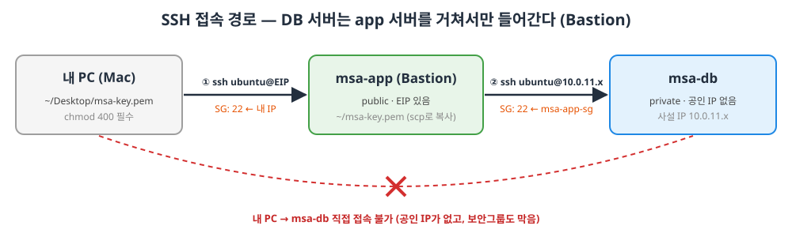

### 6-1. 키 권한 설정 (내 PC)
```bash
chmod 400 ~/Desktop/msa-key.pem   # 소유자만 읽기. 이거 안 하면 ssh가 키 사용을 거부함
```

### 6-2. msa-app 접속
```bash
ssh -i ~/Desktop/msa-key.pem ubuntu@<msa-app EIP>
# 처음 접속 시 "Are you sure...?" → yes
# 우분투 AMI의 기본 사용자 이름은 ubuntu
```

### 6-3. 키 파일을 msa-app으로 복사 [강의]
msa-app에서 msa-db로 ssh 하려면 msa-app에도 키가 있어야 합니다. **내 PC 터미널에서** 실행:
```bash
# scp -i <접속에 쓸 키> <보낼 파일> <사용자@서버:경로>
scp -i ~/Desktop/msa-key.pem ~/Desktop/msa-key.pem ubuntu@<msa-app EIP>:~/
```

### 6-4. msa-app → msa-db 접속
```bash
# (msa-app 안에서)
chmod 400 ~/msa-key.pem
ssh -i ~/msa-key.pem ubuntu@<msa-db 프라이빗 IP>   # 예: 10.0.11.23
```
> 프라이빗 IP는 EC2 콘솔 → msa-db 선택 → "프라이빗 IPv4 주소"에서 확인.
> 이 접속이 되는 이유: msa-db-sg가 **msa-app-sg에서 오는 22번**을 허용하기 때문.

> 💡 [보충] 터미널 프롬프트로 지금 어느 서버인지 확인하세요: `ubuntu@ip-10-0-1-xx` = app, `ubuntu@ip-10-0-11-xx` = db. `exit`로 한 단계씩 빠져나옵니다.

---

## 7. DB 서버 셋팅 (MySQL)

> 아래는 모두 **msa-db 안에서** 실행합니다.

### 7-1. 기본 셋팅 [강의]
```bash
sudo apt update && sudo apt upgrade -y        # 패키지 목록 갱신 + 업그레이드 (NAT 덕분에 가능!)
sudo timedatectl set-timezone Asia/Seoul       # 서버 시간을 한국 시간으로
sudo apt install -y mysql-server               # MySQL 설치
mysql --version                                # 설치 확인
sudo systemctl status mysql                    # active (running) 이면 정상 (q로 나가기)
sudo systemctl enable mysql                    # 서버 재부팅 시 자동 시작
```
> `apt update`가 멈추거나 실패하면 → **NAT / private 라우팅 테이블** 설정 문제입니다. (12장 참고)

### 7-2. 외부(app 서버)에서 접속 허용 [강의]
MySQL은 기본적으로 **자기 자신(127.0.0.1)에서 오는 접속만** 받습니다. app 서버에서 접속하려면 바꿔야 합니다.

```bash
sudo vi /etc/mysql/mysql.conf.d/mysqld.cnf
```
수정/추가할 내용 (`[mysqld]` 섹션):
```ini
bind-address            = 0.0.0.0          # 127.0.0.1 → 0.0.0.0 (모든 네트워크 인터페이스에서 수신)
character-set-server    = utf8mb4          # 한글/이모지 깨짐 방지
collation-server        = utf8mb4_unicode_ci
```
> vi 사용법: `/bind` 로 검색 → `i` 입력모드 → 수정 → `esc` → `:wq` 저장 종료

```bash
sudo systemctl restart mysql     # 설정 반영
```

> 🔐 "0.0.0.0이면 전 세계에 열린 것 아닌가?" → 아닙니다. **보안그룹(msa-db-sg)이 msa-app-sg에서 오는 3306만 허용**하고, 애초에 공인 IP도 없습니다. **네트워크 방어는 AWS가, 계정 방어는 MySQL이** 담당하는 2중 구조입니다.

### 7-3. 데이터베이스 & 테이블 생성 [보충]
로컬에서는 `docker/db/*.sql`이 MySQL 컨테이너 시작 시 자동 실행됐지만, EC2에 직접 설치한 MySQL은 **직접 실행해야** 합니다. `auth.sql` / `board.sql` 안에 `CREATE DATABASE board_auth`, `CREATE DATABASE board_app` 과 테이블 생성문이 들어있습니다.

```bash
# (내 PC) → app 서버로 복사
scp -i ~/Desktop/msa-key.pem docker/db/*.sql ubuntu@<EIP>:~/
# (msa-app) → db 서버로 복사
scp -i ~/msa-key.pem ~/*.sql ubuntu@<msa-db 프라이빗 IP>:~/
# (msa-db) 실행
sudo mysql < ~/auth.sql
sudo mysql < ~/board.sql
```
> 또는 `sudo mysql` 접속 후 sql 파일 내용을 복사해서 붙여넣어도 됩니다.

### 7-4. 앱 전용 계정 만들기 [강의]
```bash
sudo mysql      # 우분투 MySQL은 root가 비밀번호 대신 리눅스 sudo 권한으로 로그인
```
```sql
CREATE USER 'app'@'10.0.1.%' IDENTIFIED BY '1234';
GRANT ALL PRIVILEGES ON board_auth.* TO 'app'@'10.0.1.%';
GRANT ALL PRIVILEGES ON board_app.*  TO 'app'@'10.0.1.%';
FLUSH PRIVILEGES;
```

| 부분 | 의미 |
|---|---|
| `'app'` | 사용자 이름 |
| `@'10.0.1.%'` | **어디서 접속할 때만** 허용할지. `10.0.1.%` = public 서브넷(`10.0.1.0/24`) 전체 → 즉 msa-app에서만 |
| `board_auth.*` | board_auth DB의 모든 테이블 |
| `FLUSH PRIVILEGES` | 권한 변경 즉시 반영 |

> MySQL에서 사용자는 `이름@호스트` 한 쌍으로 구분됩니다. `app@'10.0.1.%'`와 `app@'localhost'`는 **서로 다른 계정**입니다.
> 비밀번호 `1234`는 실습용입니다. 실제 서비스에서는 강한 비밀번호를 쓰세요.

### 7-5. app 서버에서 접속 테스트 [보충]
```bash
# (msa-app 안에서)
sudo apt install -y mysql-client
mysql -h <msa-db 프라이빗 IP> -u app -p      # 비밀번호 1234
```
```sql
SHOW DATABASES;     -- board_auth, board_app 이 보이면 🎉 과제 필수 범위 완료!
```

---

## 8. app 서버 셋팅: Docker·Git 설치와 서비스 배포

> 🆕 **09.29 수업** · 아래는 모두 **msa-app 안에서** 실행합니다. (`ssh -i ~/Desktop/msa-key.pem ubuntu@<EIP>`)

이번 장의 목표: **로컬에서 `./start.sh`로 띄우던 MSA 서비스 5개를 msa-app 서버에서 띄우는 것.**

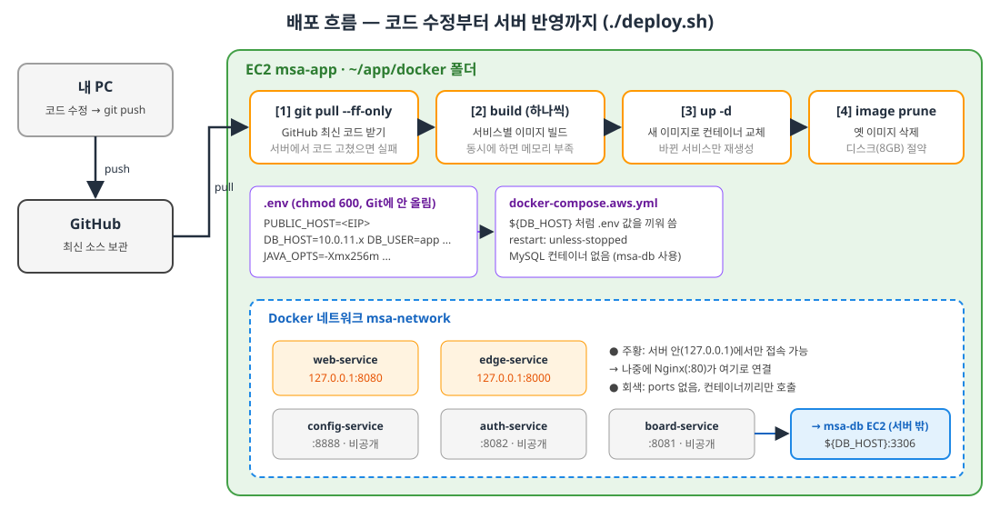

### 8-1. 로컬 vs AWS: 무엇이 달라지나
| 항목 | 로컬 (09.23) | AWS msa-app (09.29) |
|---|---|---|
| compose 파일 | data / service / front **3개** | `docker-compose.aws.yml` **1개** |
| MySQL | `mysql` 컨테이너 (`docker-compose.data.yml`) | **컨테이너 없음** → msa-db EC2의 MySQL 사용 |
| `msa-network` | data 파일이 만들고 나머지는 `external: true` | aws 파일이 **직접 생성** |
| DB 주소 | `mysql:3306` (컨테이너 이름) | `${DB_HOST}:3306` = msa-db의 **프라이빗 IP** |
| DB 계정 | root / 1234 (application.yaml 기본값) | `app` / `1234` (7-4에서 만든 계정) |
| 포트 공개 | 모든 서비스 `"8082:8082"` 처럼 공개 | web·edge만 `127.0.0.1:` 로 **서버 내부에만**, 나머지는 `ports` 없음 |
| 설정값 | compose 파일에 직접 적음 | **`.env` 파일**로 분리 |
| 실행 | `./start.sh` | **`./deploy.sh`** (git pull → build → up) |
| 서버 재부팅 시 | - | `restart: unless-stopped` 로 **자동 재시작** |

### 8-2. Docker 설치 [강의]
```bash
sudo apt update && sudo apt upgrade -y
sudo timedatectl set-timezone Asia/Seoul
curl -fsSL https://get.docker.com | sudo sh   # Docker 공식 설치 스크립트 (docker + compose 플러그인까지 설치)
sudo usermod -aG docker ubuntu                 # ubuntu 사용자를 docker 그룹에 추가 → sudo 없이 docker 사용
exit                                           # ⚠️ 그룹 변경은 "다시 로그인"해야 반영된다
```
```bash
# 내 PC에서 다시 접속
ssh -i ~/Desktop/msa-key.pem ubuntu@<EIP>
docker version            # Client / Server 둘 다 나오면 OK
docker compose version    # Docker Compose version v2.x
```

| 명령 | 뜻 |
|---|---|
| `curl -fsSL <URL>` | URL의 내용을 조용히(`-s`) 받아오고, 실패하면 에러(`-f`), 리다이렉트 따라감(`-L`), 에러는 보여줌(`-S`) |
| `\| sudo sh` | 받아온 설치 스크립트를 관리자 권한으로 바로 실행 (파이프: 앞 결과 → 뒤 입력) |
| `usermod -aG docker ubuntu` | `-a` 기존 그룹 유지하며 **추가**(append), `-G` 그룹 지정 |

> 💡 Mac에서는 Docker Desktop이 리눅스 VM을 띄웠지만, **EC2는 이미 리눅스(우분투)** 라서 Docker 엔진을 바로 설치합니다.

### 8-3. Git 설치 + GitHub Deploy Key [강의]
서버가 GitHub에서 코드를 받아오려면(`git clone`, `git pull`) **서버 전용 SSH 키**가 필요합니다.

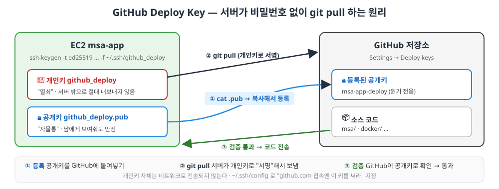

**① Git 설치 & 키 만들기**
```bash
sudo apt install -y git
ssh-keygen -t ed25519 -C "msa-app-deploy" -f ~/.ssh/github_deploy -N ""
```
| 옵션 | 뜻 |
|---|---|
| `-t ed25519` | 키 알고리즘. RSA보다 짧고 빠르면서 안전 (GitHub 권장) |
| `-C "msa-app-deploy"` | 키 끝에 붙는 **메모(이름표)**. 인증과는 무관 |
| `-f ~/.ssh/github_deploy` | 저장 경로 → 개인키 `github_deploy`, 공개키 `github_deploy.pub` 두 파일 생성 |
| `-N ""` | 키 암호를 **빈 값**으로 → 사람이 없어도 서버가 자동으로 `git pull` 가능 |

> 🔑 **개인키 = 열쇠** (서버에만, 절대 공유 X) / 🔒 **공개키 = 자물통** (GitHub에 등록, 보여줘도 안전)
> EC2 접속용 `msa-key.pem` 과는 **완전히 별개의 키**입니다. (pem = 내 PC → EC2, github_deploy = EC2 → GitHub)

**② 공개키를 GitHub에 등록 (Deploy key)**
```bash
cat ~/.ssh/github_deploy.pub     # ssh-ed25519 AAAA... msa-app-deploy  ← 이 한 줄 전체를 복사
```
[보충] GitHub 저장소 페이지 → **Settings** → 왼쪽 **Deploy keys** → **Add deploy key**
- Title: `msa-app-deploy`
- Key: 복사한 한 줄 붙여넣기
- **Allow write access: 체크하지 않음** (서버는 받기만 하면 됨 = 읽기 전용이 안전)
- **Add key**

> ⚠️ **[보충] 어느 저장소에 등록하나?** Deploy key는 **저장소 관리자(Settings 메뉴가 보이는 사람)만** 등록할 수 있습니다. 강의 영상의 `DongWoonKim/programmers-dev-lect`는 강사님 저장소라 내가 등록할 수 없어요.
> - **방법 A (강의 방식 그대로)**: 내 GitHub 저장소(Fork 또는 내 실습 저장소)에 Deploy key를 등록하고, 아래 `git clone` 주소를 **내 저장소 주소**로 바꾸기. 이때 저장소 맨 위에 `docker/`, `msa/` 폴더가 있어야 compose의 `../msa/...` 경로가 맞습니다.
> - **방법 B (공개 저장소를 받기만 할 때)**: 키 없이 HTTPS로 받기 → `git clone https://github.com/DongWoonKim/programmers-dev-lect.git`

**③ SSH 설정: "github.com에 접속할 땐 이 키를 써라"**
```bash
cat <<'EOF' >> ~/.ssh/config
Host github.com
    IdentityFile ~/.ssh/github_deploy
    IdentitiesOnly yes
EOF
chmod 600 ~/.ssh/config
```
| 줄 | 뜻 |
|---|---|
| `cat <<'EOF' >> 파일` ... `EOF` | 여러 줄을 파일 **끝에 추가**(`>>`) (heredoc, 09.28 리눅스 명령어) |
| `Host github.com` | 아래 설정은 github.com 접속에만 적용 |
| `IdentityFile` | 사용할 개인키 경로 |
| `IdentitiesOnly yes` | 다른 키는 시도하지 말고 **이 키만** 사용 |
| `chmod 600` | 소유자만 읽기/쓰기 (권한이 느슨하면 ssh가 설정 파일을 거부) |

**④ 연결 테스트 & 코드 받기**
```bash
ssh -T git@github.com
# 처음엔 "Are you sure you want to continue connecting (yes/no)?" → yes
# "Hi <저장소이름>! You've successfully authenticated, but GitHub does not provide shell access."
#  → 에러처럼 보이지만 이게 성공 메시지!

git clone git@github.com:DongWoonKim/programmers-dev-lect.git   # 방법 A라면 내 저장소 주소로
mv ~/programmers-dev-lect ~/app                                  # 폴더 이름을 짧게 변경
cd ~/app/docker                                                  # 이후 작업은 모두 이 폴더에서
```

### 8-4. `docker-compose.aws.yml` 작성 [강의]
`~/app/docker` 에서 `vi docker-compose.aws.yml` → `i` → 아래 내용 붙여넣기 → `esc` → `:wq`

```yaml
name: msa-aws

networks:
  msa-network:
    name: msa-network          # external 아님 → 이 파일이 네트워크를 직접 만든다

x-common: &common              # 공통 설정 묶음에 "common" 이라는 이름표(앵커)를 붙임
  restart: unless-stopped
  networks: [msa-network]

services:
  config-service:
    <<: *common                # common 내용을 여기에 펼쳐 넣기 (복붙 대신)
    build: ../msa/config-service
    image: config-service:latest
    container_name: config-service
    volumes:
      - ../msa/config-repo:/config-repo:ro
    environment:
      CONFIG_REPO_PATH: file:/config-repo
      JAVA_OPTS: ${JAVA_OPTS}
    # ports 없음 → 호스트에도 공개하지 않는다. 같은 네트워크의 컨테이너만 접근
    healthcheck:
      test: ["CMD", "bash", "-c", "echo > /dev/tcp/127.0.0.1/8888"]
      interval: 5s
      timeout: 3s
      retries: 40

  auth-service:
    <<: *common
    build: ../msa/auth-service
    image: auth-service:latest
    container_name: auth-service
    depends_on:
      config-service: { condition: service_healthy }
    environment:
      CONFIG_SERVICE_URL: http://config-service:8888
      DB_URL: "jdbc:mysql://${DB_HOST}:3306/board_auth?useSSL=false&allowPublicKeyRetrieval=true&serverTimezone=Asia/Seoul&characterEncoding=UTF-8"
      SPRING_DATASOURCE_USERNAME: ${DB_USER}
      SPRING_DATASOURCE_PASSWORD: ${DB_PASSWORD}
      BOARD_SERVICE_URL: http://board-service:8081
      # OAuth 성공 후 브라우저를 돌려보낼 주소 (application.yaml 의 web-service.url)
      WEB_SERVICE_URL: http://${PUBLIC_HOST}
      JAVA_OPTS: ${JAVA_OPTS}

  board-service:
    <<: *common
    build: ../msa/board-service
    image: board-service:latest
    container_name: board-service
    depends_on:
      config-service: { condition: service_healthy }
    environment:
      CONFIG_SERVICE_URL: http://config-service:8888
      DB_URL: "jdbc:mysql://${DB_HOST}:3306/board_app?useSSL=false&allowPublicKeyRetrieval=true&serverTimezone=Asia/Seoul&characterEncoding=UTF-8"
      SPRING_DATASOURCE_USERNAME: ${DB_USER}
      SPRING_DATASOURCE_PASSWORD: ${DB_PASSWORD}
      AUTH_SERVICE_URL: http://auth-service:8082
      JAVA_OPTS: ${JAVA_OPTS}
    volumes:
      - board-uploads:/app/uploads

  edge-service:
    <<: *common
    build: ../msa/edge-service
    image: edge-service:latest
    container_name: edge-service
    depends_on:
      config-service: { condition: service_healthy }
    environment:
      AUTH_SERVICE_URL: http://auth-service:8082
      BOARD_SERVICE_URL: http://board-service:8081
      TRUSTED_PROXIES: ".*"
      JAVA_OPTS: ${JAVA_OPTS}
    ports:
      - "127.0.0.1:8000:8000"   # ← 호스트의 Nginx만 접근 가능 (외부 X)

  web-service:
    <<: *common
    build: ../msa/web-service
    image: web-service:latest
    container_name: web-service
    environment:
      EDGE_SERVICE_URL: http://edge-service:8000
      JAVA_OPTS: ${JAVA_OPTS}
    ports:
      - "127.0.0.1:8080:8080"

volumes:
  board-uploads: {}
```

**핵심 포인트 정리**

| 코드 | 의미 | 왜? |
|---|---|---|
| `x-common: &common` / `<<: *common` | YAML **앵커 & 병합**. `&`로 이름 붙이고 `*`로 불러와 펼침 | 5개 서비스에 같은 설정을 반복해서 쓰지 않으려고 (`x-`로 시작하면 compose가 무시하는 "메모용" 키) |
| `restart: unless-stopped` | 컨테이너가 죽거나 **서버가 재부팅돼도 자동 재시작** (내가 `stop`한 경우만 제외) | 서버는 사람이 늘 지켜보지 않으니까 |
| `retries: 40` | 헬스체크 5초 × 40번 = **최대 200초** 기다림 (로컬은 20번) | t3.small은 느려서 config-service가 뜨는 데 더 오래 걸림 |
| `${DB_HOST}` 등 `${...}` | 같은 폴더의 **`.env` 파일 값으로 치환** | IP·비밀번호를 compose 파일에 직접 적지 않으려고 |
| `allowPublicKeyRetrieval=true` | MySQL 8의 기본 인증 방식에서 SSL 없이(`useSSL=false`) 접속할 때 필요 | 없으면 `Public Key Retrieval is not allowed` 에러 |
| `serverTimezone=Asia/Seoul` | DB 시간대를 서울로 (로컬은 UTC) | 7-1에서 서버 시간대를 서울로 맞췄으니 |
| `SPRING_DATASOURCE_USERNAME/PASSWORD` | `application.yaml`의 `spring.datasource.username: root` 를 **환경변수로 덮어씀** | AWS에선 root가 아니라 `app` 계정 사용 |
| `WEB_SERVICE_URL: http://${PUBLIC_HOST}` | 카카오 로그인 성공 후 돌아갈 주소 (`web-service.url`, 로컬 기본값 `http://localhost:8080`) | 서버에선 localhost가 아니라 **EIP 주소**여야 함 |
| `JAVA_OPTS: ${JAVA_OPTS}` | Dockerfile의 `ENV JAVA_OPTS` 를 덮어씀 → `ENTRYPOINT ["sh","-c","exec java $JAVA_OPTS -jar ..."]` 에 들어감 | 서비스별 메모리 제한 (8-5) |

**포트 바인딩 비교**

| 적는 법 | 누가 접속 가능? |
|---|---|
| `"8080:8080"` (로컬 방식) | 서버의 모든 네트워크 → **외부에서도** (보안그룹이 열려 있다면) |
| `"127.0.0.1:8080:8080"` (AWS) | **서버 자기 자신만** → 나중에 같은 서버의 Nginx가 여기로 연결 |
| `ports` 없음 | **컨테이너끼리만** (msa-network 안에서 `http://auth-service:8082`) |

### 8-5. `.env` 파일 [강의]
```bash
# ~/app/docker 에서
cat <<'EOF' > .env
PUBLIC_HOST=<Elastic IP>
DB_HOST=10.0.11.x
DB_USER=app
DB_PASSWORD=1234
# 서비스당 JVM 메모리 제한 (5개 × ~300MB)
JAVA_OPTS=-Xms64m -Xmx256m -XX:MaxMetaspaceSize=160m -Xss512k -XX:+UseSerialGC -XX:TieredStopAtLevel=1
EOF
chmod 600 .env
```
- `<Elastic IP>` → msa-app의 **EIP** (예: `3.39.65.107`), `10.0.11.x` → msa-db의 **프라이빗 IP**로 꼭 바꾸기!
- `>` 는 **덮어쓰기** (앞의 `~/.ssh/config`는 `>>` 추가였음)
- `chmod 600`: 비밀번호가 들어있으니 소유자만 읽기/쓰기
- `.env`는 서버에서만 만들고 **Git에 올리지 않습니다.**

**JAVA_OPTS 옵션 뜻** — t3.small(메모리 2GB)에 Spring 서비스 5개를 올리기 위한 다이어트

| 옵션 | 뜻 |
|---|---|
| `-Xms64m` | 힙(객체가 저장되는 메모리) **시작** 크기 64MB |
| `-Xmx256m` | 힙 **최대** 256MB (여기서 모자라면 `OutOfMemoryError`) |
| `-XX:MaxMetaspaceSize=160m` | 클래스 정보 저장 공간 최대 160MB (Spring은 클래스가 많음) |
| `-Xss512k` | 스레드 1개당 스택 크기 512KB (기본 1MB → 절반) |
| `-XX:+UseSerialGC` | 가장 단순한 GC(쓰레기 수거) 1개 스레드 → 메모리·CPU 적게 사용 |
| `-XX:TieredStopAtLevel=1` | JIT 컴파일을 1단계까지만 → 시작 빠르고 메모리 적게 (최고 성능은 약간 포기) |

| [보충] 메모리 계산 | 대략 |
|---|---|
| 서비스 1개 (힙 256 + 메타스페이스 + 스레드 등) | ~300MB |
| 서비스 5개 | ~1.5GB |
| 우분투 + Docker 엔진 | ~0.3~0.5GB |
| **합계** | **2GB에 거의 꽉 참** → 그래서 빌드는 하나씩! |

> [보충] `.env` 값이 제대로 들어갔는지 확인: `docker compose -f docker-compose.aws.yml config` → `${...}` 가 실제 값으로 바뀐 최종 설정이 출력됩니다.

### 8-6. 배포 스크립트 `deploy.sh` [강의]
```bash
# ~/app/docker 에서
cat <<'EOF' > deploy.sh
#!/bin/bash
# 사용법
#   ./deploy.sh                      전체 서비스 갱신
#   ./deploy.sh board-service        지정한 서비스만 갱신
set -e
cd "$(dirname "$0")"

COMPOSE="docker compose -f docker-compose.aws.yml"
SERVICES="${*:-config-service auth-service board-service edge-service web-service}"

echo "[1/4] 최신 코드 받기"
# --ff-only : 서버에서 코드를 고쳐서 GitHub과 갈라졌으면 병합하지 말고 실패시킨다
git pull --ff-only

echo "[2/4] 이미지 빌드 (메모리 때문에 하나씩)"
for s in $SERVICES; do
  echo "  - $s"
  $COMPOSE build "$s"
done

echo "[3/4] 컨테이너 교체"
$COMPOSE up -d $SERVICES

echo "[4/4] 이전 이미지 정리"
docker image prune -f

echo
$COMPOSE ps
EOF

chmod +x deploy.sh    # 실행 권한
./deploy.sh           # 실행!
```

| 코드 | 뜻 |
|---|---|
| `set -e` | 중간에 하나라도 실패하면 즉시 멈춤 (09.23 start.sh와 동일) |
| `cd "$(dirname "$0")"` | 어디서 실행하든 스크립트가 있는 폴더(`~/app/docker`)로 이동 |
| `SERVICES="${*:-기본값}"` | `$*` = 실행할 때 준 인자 전체. **인자가 없으면** `:-` 뒤의 기본값(서비스 5개) 사용 |
| `git pull --ff-only` | GitHub 코드를 그대로 따라가기만 함(fast-forward). 서버에서 코드를 고쳐 갈라졌으면 **병합하지 않고 실패** → 서버 코드가 몰래 달라지는 걸 막음 |
| `for s in $SERVICES; do ... done` | 서비스를 **하나씩** 빌드 (한꺼번에 빌드하면 Gradle 5개가 동시에 돌아 메모리 부족) |
| `up -d $SERVICES` | 이미지가 바뀐 컨테이너만 새로 만들어 교체, 백그라운드 실행 |
| `docker image prune -f` | 새 빌드로 이름표를 잃은 옛 이미지(`<none>`) 삭제 → 디스크(8GB) 절약. `-f` = 확인 없이 |

**앞으로의 배포 루틴**
```
내 PC: 코드 수정 → git commit → git push
서버 : cd ~/app/docker && ./deploy.sh              # 전체
       ./deploy.sh board-service                   # board만 고쳤을 때 (빠름)
```

> ⏱️ [보충] **첫 실행은 오래 걸립니다** (서비스마다 Gradle 의존성을 새로 받기 때문, 전체 수십 분 가능). 두 번째부터는 도커 캐시 덕분에 훨씬 빨라져요 (Dockerfile에서 `build.gradle`을 먼저 복사한 이유!).

### 8-7. 잘 떴는지 확인하기 [보충]
```bash
docker compose -f docker-compose.aws.yml ps     # 5개 모두 Up, config-service는 (healthy)
docker logs -f auth-service                     # 로그 실시간 보기 (Ctrl+C로 종료)
curl -I http://127.0.0.1:8080                   # web-service 응답 확인 (HTTP/1.1 200 등)
free -h                                         # 메모리 사용량
docker stats --no-stream                        # 컨테이너별 메모리/CPU
df -h /                                         # 디스크 남은 용량
```
- auth / board 로그에 에러 없이 `Started ...Application` 이 보이면 **DB 연결까지 성공**입니다.
- 아직 **브라우저로 `http://<EIP>` 접속은 안 됩니다.** 80번 포트에서 받아줄 Nginx가 없고, 8080은 `127.0.0.1`에만 열려 있기 때문 → 9장(Nginx)에서 해결.
- 그래도 화면이 뜨는지 먼저 보고 싶다면 **SSH 터널** (내 PC 터미널):
  ```bash
  ssh -i ~/Desktop/msa-key.pem -L 8080:127.0.0.1:8080 ubuntu@<EIP>
  # 접속해 둔 상태에서 내 PC 브라우저로 http://localhost:8080
  # (내 PC 8080 → SSH 통로 → 서버의 127.0.0.1:8080). 카카오 로그인 등은 Nginx 이후에 확인
  ```

### 8-8. [보충] 메모리·디스크가 부족할 때
빌드 중 서버가 멈추거나 `Killed`, `exit code 137` 이 나오면 **메모리 부족**입니다. **swap**(디스크 일부를 비상용 메모리로 쓰기)을 추가하세요.
```bash
sudo fallocate -l 2G /swapfile       # 2GB 파일 만들기
sudo chmod 600 /swapfile
sudo mkswap /swapfile                # swap 형식으로
sudo swapon /swapfile                # 켜기
echo '/swapfile none swap sw 0 0' | sudo tee -a /etc/fstab   # 재부팅 후에도 유지
free -h                              # Swap: 2.0Gi 확인
```
디스크가 부족하면(`no space left on device`):
```bash
docker system df         # 도커가 쓰는 용량 확인
docker builder prune -f  # 빌드 캐시 삭제 (다음 빌드는 다시 느려짐)
```
> swap 2GB + 도커 이미지들로 8GB 디스크가 빠듯할 수 있습니다. EC2 → 볼륨에서 EBS 크기를 늘릴 수도 있어요 (늘리기만 가능, 줄이기 불가).

---

## 9. Nginx 도입: 브라우저로 접속하기

> 🆕 **09.29 수업** · 아래는 모두 **msa-app 안에서** 실행합니다.
> 8장까지 하면 서비스는 떠 있지만 **밖에서 들어올 문이 없습니다.** (8080·8000은 `127.0.0.1`에만 열려 있음) 이번 장에서 그 문(Nginx :80)을 답니다.

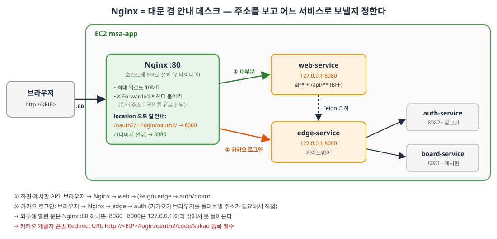

### 9-1. Nginx가 뭐고, 왜 쓰나
**Nginx = 리버스 프록시(Reverse Proxy)** = 브라우저 요청을 **대신 받아서** 뒤쪽 서버로 넘겨주는 중개자. (09.23 `docker-compose.front.yml` 주석 내용)

| 비유 | 건물 1층 **안내 데스크** — 손님은 데스크에만 말하고, 데스크가 "로그인이요? 3층 가세요" 하고 안내 |
|---|---|

| 왜 필요? | 설명 |
|---|---|
| ① 진입점 통일 | 브라우저는 `8080`, `8000` 을 몰라도 됨. **`http://<EIP>` (80번) 하나만** 알면 됨 |
| ② 내부 서비스 숨기기 | web·edge를 `127.0.0.1`에만 열어 두고, 외부에는 Nginx만 노출 |
| ③ 공통 처리를 한 곳에서 | 업로드 크기 제한, 헤더 추가, (나중에) HTTPS 인증서 등을 서비스마다 하지 않고 앞단에서 한 번에 |
| ④ 로드 밸런싱 | 같은 서비스를 여러 개 띄우면 요청을 나눠줌 (스케일 아웃의 출발점) |

> 💡 Nginx는 도커 컨테이너가 아니라 **서버(호스트)에 apt로 직접 설치**합니다. 그래서 `127.0.0.1:8080` (서버 자신)으로 web-service에 접근할 수 있어요. (8-4의 포트 바인딩 표 참고)

### 9-2. 설치 [강의]
```bash
sudo apt install -y nginx
curl -I http://127.0.0.1        # HTTP/1.1 200 OK + Server: nginx → 설치 성공 (기본 환영 페이지)
```
> 설치하자마자 Nginx가 자동으로 실행되고 부팅 시 자동 시작도 켜집니다. 상태 확인은 `sudo systemctl status nginx` (09.28 systemctl 명령어)

### 9-3. 설정 파일 작성 [강의]

**먼저 Nginx 설정 폴더 구조부터** [강의]
```
/etc/nginx/
├─ nginx.conf              ← 메인 설정. 맨 아래에서 sites-enabled/* 를 불러온다
├─ sites-available/        ← 사이트별 설정 파일 "보관함" (여기 있다고 적용되진 않음)
│   ├─ default             ← 설치 시 기본 제공 (Welcome to nginx 페이지)
│   └─ msa                 ← 우리가 만들 파일 (이름은 자유 — board, myapp 등 아무거나)
└─ sites-enabled/          ← 실제 "적용"되는 곳. 보관함 파일을 가리키는 링크만 둔다
    └─ default → ../sites-available/default   (설치 직후 상태)
```
> 한 줄 요약: **Nginx는 `sites-enabled/` 안에 있는 것만 읽는다.** (`nginx.conf` 안의 `include /etc/nginx/sites-enabled/*;` 한 줄 때문)
> 그래서 ① 보관함(`sites-available`)에 파일을 **만들고** → ② `sites-enabled`에 **링크를 걸어야**(9-4) 적용됩니다.

이제 보관함에 우리 설정 파일을 만듭니다.
```bash
sudo vi /etc/nginx/sites-available/msa
```
```nginx
server {
    listen 80 default_server;
    server_name _;

    # 게시글 첨부 최대 10MB (board-service multipart 설정과 맞춤)
    # Nginx 기본값은 1MB라 이걸 안 하면 "413 Request Entity Too Large"
    client_max_body_size 10M;

    # 공통 프록시 헤더 — 뒷단이 "브라우저가 원래 친 주소"를 알 수 있게 (auth application.yaml 주석 참고)
    proxy_set_header Host              $host;
    proxy_set_header X-Real-IP         $remote_addr;
    proxy_set_header X-Forwarded-For   $proxy_add_x_forwarded_for;
    proxy_set_header X-Forwarded-Proto $scheme;
    proxy_set_header X-Forwarded-Host  $host;

    # 카카오 로그인 시작/콜백 → edge → auth
    location /oauth2/ {
        proxy_pass http://127.0.0.1:8000;
    }
    location /login/oauth2/ {
        proxy_pass http://127.0.0.1:8000;
    }

    # 나머지 전부(화면 + /api/**) → web-service (BFF가 Feign으로 edge에 중계)
    location / {
        proxy_pass http://127.0.0.1:8080;
    }
}
```
```bash
cat /etc/nginx/sites-available/msa     # 저장 잘 됐는지 확인
```

**한 줄씩 읽기**

| 코드 | 뜻 |
|---|---|
| `server { ... }` | "웹사이트 하나"에 대한 설정 묶음 |
| `listen 80 default_server;` | 80번 포트에서 받고, 어떤 주소로 들어오든 **기본으로 이 설정** 사용 |
| `server_name _;` | 도메인 이름 무관 (`_` = 아무거나). 아직 도메인이 없고 EIP로 접속하니까 |
| `client_max_body_size 10M;` | 요청 최대 크기 10MB. board-service의 `max-file-size: 10MB`와 맞춤 (기본 1MB) |
| `proxy_set_header 이름 값;` | 뒤로 넘길 때 **헤더를 붙여서** 보냄 (아래 표) |
| `location /경로/ { ... }` | 요청 주소가 이 경로로 **시작하면** 이 블록 적용. 여러 개면 **가장 길게 일치하는 것** 우선 |
| `proxy_pass http://127.0.0.1:8000;` | 그 요청을 이 주소로 넘김 |

**location 우선순위 예시** (가장 길게 일치하는 것이 이긴다)

| 브라우저 요청 | 일치 | 가는 곳 |
|---|---|---|
| `/oauth2/authorization/kakao` | `/oauth2/` | edge :8000 → auth |
| `/login/oauth2/code/kakao?code=...` | `/login/oauth2/` | edge :8000 → auth |
| `/`, `/users/login`, `/board/1` | `/` | web :8080 |
| `/api/boards` | `/` | web :8080 → (Feign) edge → board |

**요청 흐름 한 장 정리** [강의]
```
브라우저 ─:80→ Nginx ─┬─ /                 → web-service:8080 ─Feign→ edge:8000 ─→ auth / board
                      └─ /oauth2/**         → edge:8000 → auth:8082
                         /login/oauth2/**
```

> ⚠️ 이전 버전 이 문서의 "Nginx 미리보기"에는 `/api/**`를 edge로 보낸다고 적었는데, 틀린 내용이었어요. **실제 강의 설정은 `/api/**`도 web-service(BFF)로** 보내고 web이 Feign으로 edge에 중계합니다. edge로 **직접** 가는 건 카카오 로그인 경로 2개뿐이에요.

**프록시 헤더는 왜 붙이나?** — "원래 주소 기억시키기"

Nginx를 거치면 뒤쪽 서버가 받는 요청은 **Nginx가 새로 만든 요청**이라, 원래 브라우저가 친 주소(`http://<EIP>`)와 IP를 잃어버립니다. 그래서 헤더에 적어서 넘깁니다.

| 헤더 | 담는 값 | 쓰임 |
|---|---|---|
| `Host` / `X-Forwarded-Host` | 브라우저가 친 주소 (`<EIP>`) | auth가 카카오 `redirect_uri`를 `http://<EIP>/login/oauth2/code/kakao` 로 **올바르게 조립** |
| `X-Forwarded-Proto` | `http` / `https` | 원래 프로토콜 |
| `X-Real-IP`, `X-Forwarded-For` | 실제 사용자 IP | 로그, 접속 제한 등 |

> 로컬에서 edge가 하던 일(auth `application.yaml`의 X-Forwarded 주석)을, 이제 **맨 앞의 Nginx도** 해주는 것입니다. edge의 `TRUSTED_PROXIES: ".*"` 가 "앞에서 온 X-Forwarded 헤더를 믿어라"는 설정이에요.

### 9-4. 설정 켜기 [강의]
```bash
sudo ln -s /etc/nginx/sites-available/msa /etc/nginx/sites-enabled/msa   # 켜기 (바로가기 만들기)
sudo rm /etc/nginx/sites-enabled/default                                  # 기본 환영 페이지 끄기
sudo nginx -t                 # 문법 검사 — "syntax is ok", "test is successful"
sudo systemctl reload nginx   # 끊지 않고 설정만 다시 읽기
```

| 폴더 | 역할 | 비유 |
|---|---|---|
| `/etc/nginx/sites-available/` | 설정 파일 **보관함** | 옷장 |
| `/etc/nginx/sites-enabled/` | 실제로 **켜진** 설정 (보관함 파일의 바로가기) | 오늘 입은 옷 |

**명령 전 → 후** (`sites-enabled/` 안이 이렇게 바뀝니다)
```
[설치 직후]                                   [9-4 명령 실행 후]
sites-enabled/                                sites-enabled/
└─ default → ../sites-available/default       └─ msa → /etc/nginx/sites-available/msa
   (Welcome to nginx 페이지가 켜져 있음)          (우리 설정만 켜져 있음)
```
확인: `ls -l /etc/nginx/sites-enabled/` → `msa -> /etc/nginx/sites-available/msa` 한 줄만 보이면 OK [보충]

- `ln -s <원본> <링크 위치>` : **심볼릭 링크**(윈도우 바로가기) 생성 [강의]. 끄고 싶으면 링크만 지우면 되고, 원본(보관함 파일)은 그대로 남음. 그래서 `rm sites-enabled/default` 를 해도 `sites-available/default` 는 안 지워집니다.
- `default` 를 끄는 이유 [강의]: 설치 시 default가 이미 켜져 있고 **`listen 80 default_server`를 먼저 차지**하고 있음. 그대로 두면 msa와 80번 포트가 겹쳐 에러(`duplicate default server`)가 나거나, 요청이 **default(Welcome 페이지)로 빠질** 수 있음.
- `reload` vs `restart`: reload는 접속을 끊지 않고 설정만 다시 읽음. **설정을 바꾸면 항상 `nginx -t` → `reload` 순서.**

### 9-5. 브라우저로 확인 + 카카오 설정 [강의 + 보충]
1. 서비스가 떠 있는지: `docker compose -f docker-compose.aws.yml ps` (8장)
2. 내 PC 브라우저에서 **`http://<EIP>`** → 메인 화면이 뜨면 🎉
3. **[강의] 카카오 디벨로퍼스 등록** — 카카오 로그인까지 되게 하려면 Redirect URI에
   **`http://<Elastic-IP>/login/oauth2/code/kakao`** 를 추가합니다.
   - [보충] 위치: 카카오 디벨로퍼스 → 내 애플리케이션 → 카카오 로그인 → Redirect URI (메뉴 이름은 화면 개편에 따라 조금 다를 수 있음)
   - 기존 `http://localhost:8000/login/oauth2/code/kakao` 는 로컬 개발용으로 **남겨둬도 됩니다** (여러 개 등록 가능)
   - 왜 이 주소? Nginx가 붙여준 `X-Forwarded-Host`(= EIP) 덕분에 auth가 redirect_uri를 **포트 없는 EIP 주소**로 만들기 때문 (9-3 헤더 표)
4. 로그인 후 `localhost:8080` 으로 튕기면 → `.env`의 `PUBLIC_HOST`가 EIP인지 확인 → 고쳤다면 `docker compose -f docker-compose.aws.yml up -d auth-service` (환경변수가 바뀐 컨테이너만 새로 만듦)

### 9-6. 수업 마무리 메모 [강의]
```bash
docker compose -f docker-compose.aws.yml down     # (~/app/docker 에서) 서비스 컨테이너 내리기
```
- 브라우저 **캐시 비우기: `Cmd + Shift + Delete`** (Mac 크롬) → 예전에 받은 화면·리다이렉트·쿠키가 남아 이상하게 동작할 때 (예: 로컬 `localhost`로 계속 이동)
- [보충] `down`은 컨테이너만 내립니다. **EC2·NAT·EIP 요금은 계속** 나가니, 오늘 실습이 완전히 끝났다면 11장(비용)을 확인하세요. 다음 수업에 이어서 할 거라면 EC2는 **중지**, NAT GW는 삭제 후 다시 만드는 방법도 있어요.

---

## 10. CI/CD: GitHub Actions로 자동 배포

> 🆕 **09.30 수업** · 강의 파일: 저장소 루트의 **`.github/workflows/deploy.yml`**

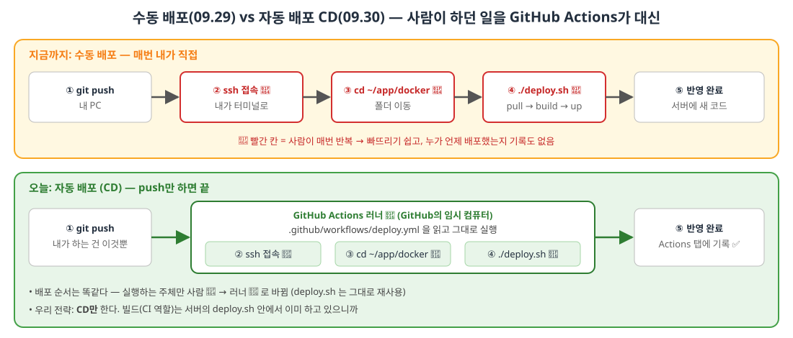

### 10-1. CI / CD가 뭔가 [강의]
| | 풀네임 | 한 줄 뜻 | 예시 |
|---|---|---|---|
| **CI** | Continuous Integration (지속적 **통합**) | 여러 사람이 올린 코드를 **자주** 합치고, 합칠 때마다 **자동으로 빌드·테스트** → 깨진 코드를 빨리 발견 | push할 때마다 `./gradlew build` / `test` 자동 실행 → 실패하면 바로 알림 |
| **CD** | Continuous Delivery / Deployment (지속적 **전달 / 배포**) | 통과한 코드를 **서버까지 자동으로** 내보내기 | push하면 서버에 새 버전이 올라가 있음 |

> 💡 비유: **CI = 자동 검수**(공장에서 불량품 걸러내기), **CD = 자동 배송**(검수 통과한 물건을 가게까지 트럭이 알아서 배달)

### 10-2. 왜 쓰나 [강의]
09.29까지 우리가 한 **수동 배포**:
```
ssh 접속 → cd ~/app/docker → ./deploy.sh (git pull → build → up)
```
- 사람이 매번 같은 순서를 반복하면 **빠뜨리기 쉽다** (예: 폴더 이동 깜빡, 다른 서버에 접속...)
- 자동화하면 **push만으로 항상 같은 절차**가 진행되고, **언제 누가 무엇을 배포했는지 기록**이 남는다 (GitHub 저장소의 **Actions** 탭)

### 10-3. 우리 전략: "CD만 한다" [강의]
| 할 일 | 누가? |
|---|---|
| **CD**: push되면 서버에 접속해서 배포 스크립트 실행 | **GitHub Actions** (새로 추가) |
| **CI**(빌드): Gradle 빌드 → 이미지 만들기 | 서버의 **`deploy.sh`** 안에서 이미 하고 있음 (8-6의 `[2/4] 이미지 빌드`) |

> 즉 **새로 배우는 건 "`./deploy.sh`를 사람 대신 실행시키는 방법"** 뿐입니다. 8장에서 만든 `deploy.sh`를 그대로 재사용해요. 😌

### 10-4. GitHub Actions 기본 용어 [강의 + 보충]
**GitHub Actions** = GitHub가 제공하는 CI/CD 도구. 저장소에 `.yml` 파일(워크플로)만 두면, 정해진 **이벤트**(push 등)마다 **GitHub의 컴퓨터(러너)** 가 대신 실행해 줍니다.
(비슷한 도구: Jenkins, GitLab CI, AWS CodePipeline ...)

| 용어 | 뜻 | 비유 |
|---|---|---|
| **워크플로 (Workflow)** | 자동화 작업 설명서. `.github/workflows/*.yml` 파일 하나 | 작업 지시서 |
| **이벤트 (on)** | 언제 실행할지 (예: `push`) | "택배가 도착하면" |
| **러너 (Runner)** | 워크플로를 실제로 실행하는 **GitHub의 임시 컴퓨터** (매번 새로 만들어졌다 사라짐) | 파견 나온 직원 |
| **잡 / 스텝 (Job / Step)** [보충] | 러너가 할 일 묶음 / 그 안의 한 단계 | 지시서의 항목들 |
| **Secrets** [보충] | 비밀번호·키 같은 값을 저장소 설정에 **암호화해서** 보관하고 워크플로에서 꺼내 씀 | 금고 |

> ⚠️ 폴더 이름은 정확히 **`.github/workflows/`** 여야 GitHub가 인식합니다. (`.github` 앞의 점 = 숨김 폴더, `ls -a`로 보임)

### 10-5. 워크플로 파일 `deploy.yml` [강의]
> 흐름: **git push → GitHub Actions → SSH로 msa-app 접속 → deploy.sh (git pull → docker build → docker up -d)**
> 파일 위치 규칙: 저장소 **루트의 `.github/workflows/`** 안의 `.yml`만 GitHub가 인식합니다.

```yaml
# Actions 탭에 표시될 워크플로 이름
name: Deploy to EC2

# 언제 실행할지(트리거)
on:
    push:
        branches:
            - deploy-test # 이 브랜치에 push할 때만 실행(test브랜치로 사용하고 싶으면 test로 변경하면된다.)
        # 아래 경로의 파일이 바뀐 push만
        # - 수업 자료(md 등)만 바꾼 push로는 배포하지 않는다.
        # - ** : 하위 폴더까지 전부
        paths:
            - "msa/**"
            - "docker/**"
            - ".github/workflows/deploy.yml"
    # Actions 탭의 "Run workflow" 버튼으로 수동 실행도 가능하게 한다.
    # 코드 변경 없이 다시 배포(.env만 수정 등), 실패한 배포 재시도, paths 에 안 걸린 push
    workflow_dispatch:

# 무엇을 할지
jobs:
    deploy:
        # 어떤 머신에서 돌릴지
        runs-on: ubuntu-latest
        # 순서대로 실행할 단계들
        steps:
            - name: Deploy to msa-app
              # uses : 다른사람이 만들어 둔 Action(재사용)을 가져다 쓴다.
              # appleboy/ssh-action@v1 : "SSH로 원격 서버에 접속해 명령을 실행" 하는 공개 Action
              # 보안그룹 : msa-app-sg에 ssh - 0.0.0.0/0 허용으로 바꿀 것
              uses: appleboy/ssh-action@v1
              # with : 그 Action에 넘기는 입력값
              with:
                # ${{ secrets.이름 }} : 저장소 Settings -> Secrets and variables -> Actions -> Repository secrets에 등록한 값
                host: ${{ secrets.EC2_HOST }} # msa-app eip
                username: ubuntu
                # cat ~/Desktop/msa-key.pem -> '%' 반드시 제거 or 메모장으로 열기
                key: ${{ secrets.EC2_SSH_KEY }} # msa-key.pem
                command_timeout: 40m # 기본 10분 -> 40분으로 늘림. 서버 빌드시간
                # | : 여러 줄을 그대로
                script: |
                    cd ~/app/docker
                    ./deploy.sh
```

**구조를 한국어로 읽으면**
```
name  : "Deploy to EC2" 라는 이름의 작업 지시서
on    : deploy-test 브랜치에 push 되었는데, msa/ · docker/ · deploy.yml 중 하나라도 바뀌었으면 (또는 버튼 누르면)
jobs  : GitHub의 우분투 컴퓨터(러너) 한 대를 빌려서
steps : appleboy/ssh-action 으로 msa-app 에 ssh 접속한 뒤 → cd ~/app/docker → ./deploy.sh
```

| 코드 | 뜻 |
|---|---|
| `on.push.branches: [deploy-test]` | **deploy-test** 브랜치에 push할 때만 실행 (처음엔 `master`였다가 09.30 수업 중 변경 → 수업 자료 push마다 배포되지 않게 **테스트용 브랜치**로 분리) |
| `paths:` | 이 경로의 파일이 바뀐 push만 배포. 수업 자료(md)만 고친 push로는 배포 안 함. `**` = 하위 폴더 전부 |
| `workflow_dispatch:` | Actions 탭의 **Run workflow 버튼**으로 수동 실행 가능 (`.env`만 고쳤을 때, 실패 재시도, paths에 안 걸린 push) |
| `runs-on: ubuntu-latest` | GitHub가 빌려주는 최신 우분투 러너에서 실행 |
| `uses: appleboy/ssh-action@v1` | 남이 만들어 둔 **"SSH로 접속해서 명령 실행" Action**을 가져다 씀 (`@v1` = 버전) |
| `with:` | 그 Action에 넘기는 입력값 (접속 정보 + 실행할 명령) |
| `${{ secrets.EC2_HOST }}` | 저장소에 등록한 **Secrets** 값을 꺼내 씀 → 코드에 IP·키를 직접 안 적음 |
| `command_timeout: 40m` | 기본 10분 → 40분. 서버에서 5개 서비스를 빌드하는 시간이 길어서 |
| `script: \|` | `\|` = 아래 여러 줄을 그대로 명령으로 실행 |

**[보충] 브랜치를 `deploy-test` 로 바꾼 뒤 주의할 점**
- 이제 **master에 push해도 배포가 안 돕니다.** 배포하려면 `deploy-test` 브랜치에 push하거나 Run workflow 버튼을 누르세요.
  ```bash
  git switch -c deploy-test        # 처음 한 번: 브랜치 만들고 이동 (이미 있으면 git switch deploy-test)
  git push -u origin deploy-test   # 이 push가 배포를 시작시킴
  ```
- ⚠️ 워크플로는 "**언제** 실행할지"만 정합니다. 서버의 `deploy.sh`는 **서버에 체크아웃된 브랜치**를 `git pull` 해요. 서버가 `master`에 있으면 `deploy-test`에 올린 변경은 **반영되지 않습니다.** → 서버에서 `cd ~/app && git branch` 로 확인하고, 필요하면 `git fetch && git switch deploy-test`

> 💡 결국 **러너가 하는 일 = 내가 9/29에 손으로 하던 `ssh` → `cd ~/app/docker` → `./deploy.sh`** 입니다. 새로운 배포 방식이 아니라 **같은 일을 대신 시키는 것**뿐이에요.

### 10-6. GitHub Secrets 등록 [강의 + 보충]
워크플로가 쓰는 비밀값 2개를 저장소에 등록합니다.
**GitHub 저장소 → Settings → Secrets and variables → Actions → Repository secrets → New repository secret**

| Name (정확히 이 이름) | Secret (값) |
|---|---|
| `EC2_HOST` | msa-app의 **EIP** (예: `3.39.65.107`) |
| `EC2_SSH_KEY` | **`msa-key.pem` 파일 내용 전체** |

`EC2_SSH_KEY` 값 복사하는 법:
```bash
cat ~/Desktop/msa-key.pem
```
- `-----BEGIN ... PRIVATE KEY-----` 부터 `-----END ... PRIVATE KEY-----` 까지 **전부** 복사 (BEGIN/END 줄 포함)
- ⚠️ [강의] 맨 끝에 붙는 **`%` 는 반드시 빼기!** → zsh가 "파일 끝에 줄바꿈이 없다"는 표시로 붙이는 것이지 키 내용이 아님. 헷갈리면 **메모장(텍스트 편집기)으로 열어서** 복사
- [보충] Secrets는 한 번 저장하면 **다시 볼 수 없습니다** (덮어쓰기만 가능). 틀렸으면 Update로 다시 붙여넣기

> 🔑 키가 3개가 됐으니 정리: **msa-key.pem** = 내 PC·러너 → EC2 접속용 / **github_deploy** = EC2 → GitHub `git pull`용 (8-3) / Secrets의 **EC2_SSH_KEY** = msa-key.pem을 러너에게 맡겨둔 것

### 10-7. 실행 & 확인 [보충]
1. `msa/`, `docker/`, `.github/workflows/deploy.yml` 중 하나를 고쳐서 **`deploy-test` 브랜치에 push** (또는 Actions 탭 → **Deploy to EC2** → **Run workflow**)
2. 저장소 **Actions** 탭 → 실행 목록 클릭 → `Deploy to msa-app` 스텝을 펼치면 서버에서 찍힌 **deploy.sh 출력**(`[1/4] 최신 코드 받기` ...)이 그대로 보임
3. 🟢 초록 체크 = 성공, 🔴 빨간 X = 실패 (로그 맨 아래부터 읽기)
4. 브라우저에서 `http://<EIP>` 새로고침 → 바뀐 내용 확인

### 10-8. [보충] 꼭 확인할 함정 3가지
| 함정 | 설명 | 해결 |
|---|---|---|
| **① 보안그룹 22번** | 러너는 **GitHub의 컴퓨터**라 IP가 매번 다름. msa-app-sg의 22번이 **"내 IP"만** 허용이면 러너가 접속 못 함 (`dial tcp ...:22: i/o timeout`) | **[강의] msa-app-sg 인바운드 SSH(22) 소스를 `0.0.0.0/0` 으로 변경.** EC2 → 보안 그룹 → msa-app-sg → 인바운드 규칙 편집 → SSH 행의 소스를 "Anywhere-IPv4". [보충] pem 키 없이는 로그인 불가라 실습엔 괜찮지만, 누구나 접속 **시도**는 할 수 있으니 실습이 끝나면 다시 "내 IP"로 좁히는 걸 추천 |
| **② 저장소가 일치해야 함** | 워크플로는 **push한 저장소**에서 돌지만, 서버의 `deploy.sh`는 **서버에 clone된 저장소**를 `git pull` 함 | 내 저장소로 자동 배포하려면 서버도 **내 저장소**를 clone해야 함 (8-3 방법 A: Deploy key를 내 저장소에 등록) |
| **③ 폴더 이름 대소문자** | `paths: "msa/**"`, compose의 `../msa/...` 는 **소문자 msa**. Mac은 대소문자를 무시하지만 **GitHub·리눅스(EC2)는 구분** | 내 저장소 폴더가 `MSA`면 `msa`로 바꾸거나, yml 경로를 폴더 이름에 맞게 수정 |


---

## 11. 비용과 자원 삭제

### 11-1. 무엇이 돈이 드나 [강의 + 보충]
| 자원 | 과금 | 비고 |
|---|---|---|
| **EC2** (t3.small × 2) | 켜져 있는 시간만큼 | 중지(Stop)하면 인스턴스 요금은 멈춤 (디스크 EBS는 소액 계속) |
| **NAT Gateway** | **생성되어 있는 동안 시간당** + 데이터 처리량 | ⚠️ 가장 조심! 안 써도 계속 과금 |
| **EIP / 공인 IPv4** | 시간당 | 연결 여부와 상관없이 과금 |
| VPC, 서브넷, IGW, 라우팅 테이블, 보안그룹, 키 페어 | 무료 | |

> 💡 실습이 끝나면 **최소한 NAT GW는 삭제**하세요. (다시 필요하면 새로 만들고 private 라우팅 테이블의 타겟만 새 NAT로 바꾸면 됨)
> 💡 [보충] **결제 대시보드 → 예산(Budgets)** 에서 월 예산 알림(예: $10)을 걸어두면 안심됩니다.

### 11-2. 삭제 순서 [강의]
의존 관계의 **역순**으로 지웁니다.

1. **EC2** 인스턴스 종료(Terminate) — msa-app, msa-db
2. **NAT Gateway** 삭제 → 상태가 Deleted 될 때까지 대기
3. **탄력적 IP** 릴리스 (앱용 + NAT용 **2개** 모두! 연결 해제 후 릴리스)
4. **보안그룹** 삭제 (msa-db-sg 먼저 — app-sg를 참조하고 있으므로), **키 페어** 삭제
5. **VPC** 삭제 → 서브넷, IGW, 라우팅 테이블이 함께 정리됨

---

## 12. 자주 막히는 곳 (트러블슈팅)

| 증상 | 원인 / 확인할 것 |
|---|---|
| `ssh` 가 한참 멈추다 **Connection timed out** | ① msa-app-sg 22번 소스가 **현재 내 IP**인지 (카페/집 이동 시 IP 바뀜 → "내 IP"로 다시 설정) ② public 라우팅에 `0.0.0.0/0 → IGW` 있는지 ③ public 서브넷이 public-rt에 연결됐는지 ④ EIP가 msa-app에 연결됐는지 |
| **Permission denied (publickey)** | ① 사용자 이름이 `ubuntu` 인지 ② 키 파일 경로 오타 ③ 인스턴스 만들 때 고른 키가 맞는지 |
| **UNPROTECTED PRIVATE KEY FILE!** | `chmod 400 <키파일>` 안 함 |
| msa-app → msa-db ssh가 timeout | msa-db-sg 22번 소스가 **msa-app-sg**인지, db의 **프라이빗 IP**로 접속했는지 |
| msa-db에서 `apt update` 멈춤 | ① NAT GW가 **public 서브넷**에 있고 Available 상태인지 ② private-rt에 `0.0.0.0/0 → NAT` 있는지 ③ private 서브넷이 private-rt에 연결됐는지 |
| app에서 `mysql -h` 접속 시 **Can't connect** | ① msa-db-sg 3306 소스 = msa-app-sg ② `bind-address = 0.0.0.0` 후 `restart` 했는지 ③ `sudo systemctl status mysql` |
| **Access denied for user 'app'@'10.0.1.xx'** | 계정 호스트(`10.0.1.%`)와 실제 app IP 대역 일치 여부, 비밀번호, `FLUSH PRIVILEGES` |
| EC2 생성 화면에 msa-vpc / 보안그룹이 안 보임 | 리전이 서울인지, 보안그룹을 **msa-vpc**로 만들었는지 |
| 라우팅 편집에 IGW가 안 보임 | IGW를 **VPC에 연결(Attach)** 안 함 |

**app 서버 · 배포 (09.29)**

| 증상 | 원인 / 확인할 것 |
|---|---|
| `permission denied while trying to connect to the Docker daemon socket` | `usermod -aG docker ubuntu` 후 **exit → 재접속**을 안 함 (`groups` 명령에 docker가 보여야 함) |
| `ssh -T git@github.com` → **Permission denied (publickey)** | ① Deploy key를 GitHub에 등록했는지 ② `~/.ssh/config` 경로/오타 ③ 공개키를 **한 줄 전체** 복사했는지 |
| `git clone` → **Repository not found** | Deploy key를 등록한 저장소와 clone 주소가 다름 (Deploy key는 **그 저장소 하나**에만 유효) |
| `WARN The "DB_HOST" variable is not set` | `.env`가 `docker-compose.aws.yml`과 **같은 폴더**(`~/app/docker`)에 없거나 파일 이름 오타 |
| 빌드 중 서버가 멈춤 / `Killed` / `exit code 137` | 메모리 부족 → 하나씩 빌드(deploy.sh), swap 추가 (8-8) |
| `no space left on device` | 디스크 부족 → `docker system df`, `docker builder prune -f`, EBS 늘리기 |
| config-service가 계속 `unhealthy` / 다른 서비스가 안 뜸 | `docker logs config-service` 확인. config-repo 경로(`../msa/config-repo`)가 맞는지 |
| auth/board가 재시작 반복, 로그에 `Communications link failure` | DB에 닿지 못함 → ① `.env`의 `DB_HOST`가 msa-db **프라이빗 IP**인지 ② msa-db-sg 3306 ← msa-app-sg ③ `bind-address = 0.0.0.0` |
| 로그에 `Public Key Retrieval is not allowed` | DB_URL에 `allowPublicKeyRetrieval=true` 빠짐 |
| 로그에 `Access denied for user 'app'@'10.0.1.x'` | `.env`의 `DB_USER` / `DB_PASSWORD` 가 7-4에서 만든 계정과 다름 |
| `git pull --ff-only` → **Not possible to fast-forward** | 서버에서 저장소 파일을 직접 고침 → `git status`로 확인 후 `git restore <파일>` 로 되돌리기 |
| `git pull` → **untracked working tree files would be overwritten** | 서버에서 만든 파일(예: `docker-compose.aws.yml`)과 같은 이름의 파일이 GitHub에 새로 올라옴 → 서버 파일을 백업(`mv 파일 파일.bak`) 후 다시 pull |
| 브라우저로 `http://<EIP>` 접속 안 됨 (Nginx 전) | 정상! 아직 Nginx가 없음 (9장). 서버 안에서 `curl -I http://127.0.0.1:8080` 으로 확인 (Nginx까지 했다면 아래 표) |

**CI/CD · GitHub Actions (09.30)**

| 증상 | 원인 / 확인할 것 |
|---|---|
| push했는데 Actions가 **아예 안 돎** | ① **`deploy-test`** 브랜치에 push했는지 (master는 이제 안 돎) ② 바뀐 파일이 `paths`(msa/ · docker/ · deploy.yml)에 해당하는지 ③ 파일 위치가 정확히 `.github/workflows/` 인지 ④ 폴더 대소문자(`MSA` ≠ `msa`) |
| `dial tcp <EIP>:22: i/o timeout` | 러너가 22번에 못 들어옴 → msa-app-sg 22번 소스 확인 (10-8 ①) |
| `ssh: no key found` / `unable to authenticate` | `EC2_SSH_KEY` 값 문제 → BEGIN~END 전체 복사, 끝의 `%` 제거, `username: ubuntu` |
| `ssh: handshake failed ... host` 관련 | `EC2_HOST`에 `http://` 를 붙였거나 오타 → IP만 입력 |
| `cd: /home/ubuntu/app/docker: No such file` | 서버에 `~/app` 이 없음 (8-3의 clone + `mv` 안 함) |
| `./deploy.sh: Permission denied` | 서버에서 `chmod +x deploy.sh` 안 함 |
| `git pull` 단계에서 실패 | 서버 저장소 상태 문제 → 8장 트러블슈팅(`--ff-only`, untracked files) 참고 |
| 오래 돌다가 `command timeout` | 빌드가 40분 초과 → 메모리 부족 의심 (8-8 swap), 또는 `command_timeout` 늘리기 |
| Actions는 성공인데 **내 변경이 반영 안 됨** | ① 서버가 **다른 저장소**(예: 강사님 저장소)를 pull 하고 있음 (10-8 ②) → `cd ~/app && git remote -v` ② 서버가 **다른 브랜치**(master)에 있음 → `git branch` 확인 (10-5 주의) |

**Nginx (09.29)**

| 증상 | 원인 / 확인할 것 |
|---|---|
| 브라우저가 계속 로딩하다 **연결 실패** | ① msa-app-sg에 **80번(0.0.0.0/0)** 열려 있는지 ② `sudo systemctl status nginx` ③ 주소를 `https://`가 아니라 **`http://`** 로 쳤는지 |
| **"Welcome to nginx!"** 페이지가 뜸 | `sites-enabled/default`를 안 지웠거나, `ln -s`를 안 했거나, `reload`를 안 함 |
| `nginx -t` → **duplicate default server** | `default`와 `msa` 둘 다 `default_server` → `sudo rm /etc/nginx/sites-enabled/default` |
| `nginx -t` → **unexpected "}"** / **invalid parameter** | 설정 파일 오타 (줄 끝 `;` 빠짐이 제일 흔함) → `sudo vi`로 다시 확인 |
| **502 Bad Gateway** | Nginx는 OK, **뒤쪽 서비스가 안 떠 있음** → `docker compose -f docker-compose.aws.yml ps`, `curl -I http://127.0.0.1:8080` |
| **413 Request Entity Too Large** | `client_max_body_size 10M;` 빠짐 (파일 업로드 시) |
| 카카오 로그인 → **KOE006** | 카카오 개발자 콘솔 Redirect URI에 `http://<EIP>/login/oauth2/code/kakao` 미등록 |
| 로그인 후 **localhost** 로 이동 | `.env`의 `PUBLIC_HOST` 확인 → `up -d auth-service`, 브라우저 캐시 비우기(`Cmd+Shift+Delete`) |
| 화면이 예전 그대로 / 이상한 리다이렉트 반복 | 브라우저 캐시·쿠키 → `Cmd+Shift+Delete` 또는 시크릿 창으로 확인 |

---

## 13. 최종 체크리스트

**인프라 (필수)**
- [ ] 리전: 서울(ap-northeast-2)
- [ ] `msa-vpc` (10.0.0.0/16)
- [ ] `msa-public-a-subnet` (10.0.1.0/24), `msa-private-a-subnet` (10.0.11.0/24)
- [ ] `msa-igw` 생성 + msa-vpc 연결
- [ ] `msa-public-rt`: 0.0.0.0/0 → IGW, public 서브넷 연결
- [ ] `msa-nat`: public 쪽, EIP 할당, Available
- [ ] `msa-private-rt`: 0.0.0.0/0 → NAT, private 서브넷 연결
- [ ] `msa-app-sg` (22 내 IP, 80 전체), `msa-db-sg` (22·3306 ← msa-app-sg)
- [ ] EC2 `msa-app` (public, 공인 IP O, EIP 연결), `msa-db` (private, 공인 IP X)

**접속 & DB (필수)**
- [ ] 내 PC → msa-app SSH 성공
- [ ] 키 scp 후 msa-app → msa-db SSH 성공
- [ ] msa-db: apt update 성공 (= NAT 정상), MySQL 설치 / enable
- [ ] bind-address 0.0.0.0, utf8mb4 설정 후 restart
- [ ] board_auth, board_app DB + 테이블 생성
- [ ] `app@'10.0.1.%'` 계정 + 권한
- [ ] msa-app에서 `mysql -h <db IP> -u app -p` 접속 성공

**app 서버 · 배포 (09.29)**
- [ ] Docker 설치, `usermod` 후 재접속 → `docker version` / `docker compose version`
- [ ] Git 설치, `ssh-keygen`으로 `~/.ssh/github_deploy` 생성
- [ ] GitHub 저장소에 Deploy key 등록 (읽기 전용), `~/.ssh/config` 작성 + `chmod 600`
- [ ] `ssh -T git@github.com` → "successfully authenticated"
- [ ] `git clone` → `~/app` 으로 이름 변경
- [ ] `~/app/docker/docker-compose.aws.yml` 작성
- [ ] `~/app/docker/.env` 작성 (EIP, DB 프라이빗 IP 실제 값으로) + `chmod 600`
- [ ] `deploy.sh` 작성 + `chmod +x` → `./deploy.sh` 성공
- [ ] `ps`에서 5개 Up, auth/board 로그에 DB 에러 없음, `curl -I http://127.0.0.1:8080` 응답

**Nginx (09.29)**
- [ ] `sudo apt install -y nginx` → `curl -I http://127.0.0.1` 200
- [ ] `/etc/nginx/sites-available/msa` 작성
- [ ] `ln -s` 로 sites-enabled에 연결, `default` 삭제
- [ ] `sudo nginx -t` → syntax is ok → `sudo systemctl reload nginx`
- [ ] 내 PC 브라우저 `http://<EIP>` 화면 확인
- [ ] 카카오 Redirect URI `http://<EIP>/login/oauth2/code/kakao` 등록 → 카카오 로그인 확인

**CI/CD (09.30)**
- [ ] 내 저장소 루트에 `.github/workflows/deploy.yml` (폴더 이름 `msa` 소문자 확인)
- [ ] Secrets 등록: `EC2_HOST` (EIP), `EC2_SSH_KEY` (pem 전체, `%` 제거)
- [ ] 서버의 `~/app` 이 **내 저장소**를 clone한 것인지 (`git remote -v`)
- [ ] msa-app-sg 22번 소스 `0.0.0.0/0` 으로 변경 [강의] (실습 후 다시 좁히기)
- [ ] `deploy-test` 브랜치 생성 → 서버도 같은 브랜치를 pull 하는지 확인
- [ ] Actions 탭 → Run workflow (또는 push) → 🟢 성공 → 브라우저에서 변경 확인

**정리**
- [ ] 실습 후 NAT GW / EC2 / EIP 정리 (비용!)

---

### 📚 용어 한 줄 사전
- **Region / AZ**: 지역 / 지역 안의 데이터센터
- **VPC**: 나만의 가상 사설 네트워크
- **CIDR**: IP 범위 표기법 (`/16`, `/24`)
- **Subnet**: VPC를 쪼갠 구역
- **IGW**: VPC ↔ 인터넷 양방향 문
- **NAT GW**: private → 인터넷 나가기 전용 문
- **Route Table**: 목적지별 경로 규칙, 서브넷에 연결
- **Security Group**: EC2 단위 방화벽 (인바운드 기본 차단)
- **EC2 / AMI**: 가상 서버 / 서버에 깔 OS 이미지
- **Key Pair (.pem)**: SSH 접속 열쇠
- **EIP**: 고정 공인 IP
- **Bastion**: 내부 서버로 들어가기 위한 중간 서버
- **Deploy key**: 저장소 하나에만 등록하는 서버 전용 SSH 공개키 (보통 읽기 전용)
- **.env**: compose가 자동으로 읽는 환경변수 파일 (`${변수}` 치환)
- **JAVA_OPTS**: JVM 실행 옵션 (메모리 제한 등)
- **swap**: 메모리가 모자랄 때 디스크를 비상 메모리로 쓰는 공간
- **Nginx / 리버스 프록시**: 요청을 대신 받아 뒤쪽 서버로 넘겨주는 앞단 서버
- **location / proxy_pass**: "이 경로로 오면" / "여기로 넘겨라"
- **X-Forwarded-***: 프록시를 거쳐도 원래 주소·IP를 잃지 않게 붙이는 헤더
- **502 Bad Gateway**: 프록시는 살아있는데 뒤쪽 서버가 응답이 없음
- **CI / CD**: 자동 빌드·테스트 / 자동 배포
- **GitHub Actions**: GitHub의 CI/CD 도구, `.github/workflows/*.yml` 로 정의
- **러너 (Runner)**: 워크플로를 실행하는 GitHub의 임시 컴퓨터
- **Secrets**: 키·비밀번호를 암호화해 보관하는 GitHub 저장소 설정
- **Action (uses)**: 남이 만들어 둔 재사용 부품 (예: `appleboy/ssh-action`)
- **workflow_dispatch**: Actions 탭에서 버튼으로 수동 실행하는 트리거
