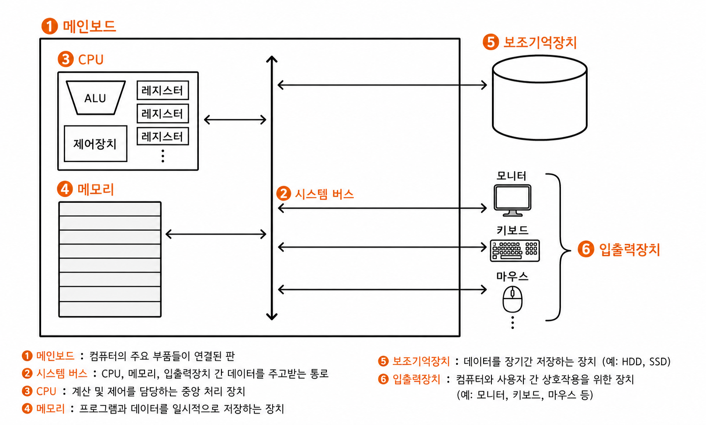

# 컴퓨터 구조

- 컴퓨터가 이해하는 정보 : 데이터, 명령어
- 컴퓨터의 네 가지 핵심 부품 : cpu(중앙처리장치), RAM(메모리, 주기억장치), 보조기어장치, 입출력장치

---

## 컴퓨터가 이해하는 정보

- **데이터** : 컴퓨터가 이해하는 숫자, 문자, 이미지, 동영상과 같은 정적인 정보
- **명령어** : 컴퓨터를 실질적으로 작동 시키는 정보

> 명령어는 컴퓨터를 작동시키는정보이고, 데이터는 명령어를 위해 존재하는 일종의 재료이다.

---

## 컴퓨터의 네 가지 핵심 부품

### 메모리
- 현재 실행되는 프로그램의 명령어와 데이터를 저장하는 부품이다.
- 프로그램이 실행되려면 반드시 메모리에 저장되어 있어야한다.
- 이때 컴퓨터가 빠르게 작동하기 위해서는 메모리 속 명령어와 데이터 구조가 중구난방으로 저장되어 있으면 안된다. 그래서 메모리에는 저장된 값에 빠르고 효율적으로 접근하기 위해 주소라는 개념이 사용된다.
- 메모리에 저장된 값의 위치는 주소로 알 수 있다.

### CPU
- 메모리에 저장된 명령어를 읽어 들이고, 읽어 들인 명령어를 해석하고, 실행하는 부품이다.
- CPU의 작동 원리를 구체적으로 이해하기 위해서는 CPU 내부 구성 요소를 알아야 한다.
    - **ALU(산술논리연산장치)** : 컴퓨터 내부에서 수행되는 대부분의 계산을 도맡아 수행
    - **레지스터** : CPU 내부의 작은 임시 저장 장치
    - **제어장치** : 전기 신호를 내보내고 명령어를 해석하는 장치

**레지스터**는 CPU **안에** 있는 아주 작은 임시 저장 공간이다. 개수가 몇십 개뿐이지만 **속도가 극도로 빠릅니다.** 
**메모리(RAM)** 는 CPU **바깥에** 있는 훨씬 큰 저장 공간이에요. 프로그램의 코드와 데이터를 담고 있고, 레지스터보다 용량이 비교가 안 되게 크지만 **상대적으로 느리다.**

핵심: **CPU는 계산을 "레지스터에 있는 값"으로만 할 수 있다.** 메모리에 있는 데이터를 직접 더하거나 빼지 못한다. 그래서 항상 이 순서로 움직인다:
1. 메모리에서 필요한 값을 레지스터로 **가져온다 (load, 읽기)**
2. 레지스터 안에서 계산한다
3. 결과를 다시 메모리에 **저장한다 (store, 쓰기)**

### 보조기억장치
- 메모리는 가격이 비싸 저장 용량이 적고, 전원이 꺼지면 저장된 내용을 잃는다는 약점이 있다. 이에 메모리보다 크기가 크고 전원이 꺼져도 저장된 내용을 잃지 않는 메모리를 보조할 저장 장치가 필요하게 되었는데, 이 저장 장치가 보조기억장치이다.(하드 디스크, SSD, USB,...)
- 메모리가 현재 '실행되는' 프로그램을 저장한다면, 보조기억장치는 '보관할' 프로그램을 저장한다.

### 입출력장치

- 컴퓨터 외부에 연결되어 컴퓨터 내부와 정보를 교환하는 장치

---

### 메인보드와 시스템 버스

- 지금까지 설명한 컴퓨터의 핵심부품들은 모두 메인보드라는 판에 연결된다. 혹은 마더보드라고도 한다.
- 메인보드에 연결된 부품들은 서로 정보를 주고 받을 수 있는데, 이는 메인보드 내부에 버스라는 통로가 있기 때문이다. 컴퓨터 내부에는 다양한 종류의 통로, 즉 버스가 있다. 하지만 여러 버스 가운데 컴퓨터의 네 가지 핵심 부품을 연결하는 가장 중요한 버스는 시스템 버스이다.
